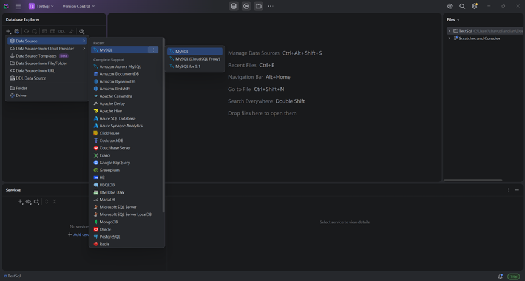
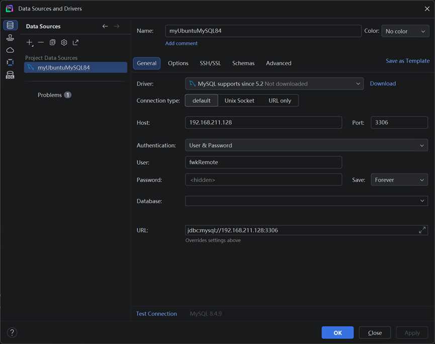

# MySQL数据库安装、连接

## Windows

✅安装

https://dev.mysql.com/downloads/mysql/

可在MySQL文件夹先创建两个文件夹 install 和 data

打开MySQL Configurator，其中：

   Data Directory可选刚创建的文件夹data

   记住端口是3306

   填MySQL Root Passward: 例如fwk123

   …其余默认

此时MySQL服务已启动


✅卸载

任务管理器——服务——MYSQL84  停止

控制面板——程序——程序和功能，右击卸载，按提示操作即可


## Linux

✅安装

```shell
sudo apt update
```

https://dev.mysql.com/downloads/repo/apt/

```shell
wget https://dev.mysql.com/get/mysql-apt-config_0.8.39-1_all.deb
sudo dpkg -i mysql-apt-config_0.8.39-1_all.deb
```

按提示选择 mysql-8.4-lts

```shell
sudo apt update
sudo apt install mysql-server -y
```

设置root密码：fwk123

启动服务

```shell
sudo systemctl start mysql
```

开机自启

```shell
sudo systemctl enable mysql
```

查看运行状态

```shell
sudo systemctl status mysql
```

看到active (running)表示正在运行

停止服务

```shell
sudo systemctl stop mysql
```


## 连接数据库

用户名是你登录的用户，主机名或者IP地址为可选项，如果是本地连接则不需要，远程连接需要填写，密码是对应用户的密码

```shell
mysql –u 用户名 [–h 主机名或者IP地址, -P 端口号] –p 密码
```

- 输入-p后可以直接跟上密码，也可以按回车，会提示你输入密码，二者都是相同的效果
- `-h 127.0.0.1` 其中“-h”是参数，“127.0.0.1” 是 IP 地址，默认本地参数可忽略
- `-P 3306` 其中“-P”是参数，“3306” 是端口号，默认本地参数可忽略

```shell
mysql -u root -p
```

```shell
mysql -h 127.0.0.1 -P 3306 -u root -p rootpassword

...
mysql>
```

只需要在`mysql>`命令中输入 SQL 语句，同时并以分号“;”结束。最后摁`Enter`键即可：

- 命令输入在`mysql>` 之后
- 用`q\`、`quit`、`exit`三种命令可以退出命令行实用程序
- 帮助命令，输入`help`或`\h`获得帮助，可以获得其它特定的命令的帮助(如，输入help select获得使用SELECT语句的帮助)


⭐使用管理工具远程连接

先创建远程用户

远程用户：fwkRemote，密码：remote

```sql
CREATE USER 'fwkRemote'@'%' IDENTIFIED BY 'remote';
```

这里是授权全部数据库的所有权限，也可以是某一个数据库或某一个数据库的某一个表，也可以是部分权限，等等

```sql
GRANT ALL PRIVILEGES ON *.* TO 'fwkRemote'@'%' WITH GRANT OPTION;
```

刷新权限，立即生效

```sql
FLUSH PRIVILEGES;
```

重启数据库

```shell
sudo systemctl restart mysql
```

开放 Ubuntu 防火墙端口，开放 3306

```shell
sudo ufw allow 3306/tcp
```


**DataGrip**

新建工程





选择schema或新建schema即可

右击新建console即可输入SQL命令了


**Navicat**

点击连接

略

点击【新建查询】编写SQL语句


# 数据库管理

## 创建数据库 

创建test数据库

```sql
CREATE DATABASE test;
```

若此数据库存在则报错，可加上IF NOT EXISTS

```sql
CREATE DATABASE IF NOT EXISTS test;
```


## 查看数据库

数据库连接成功之后，可查看当前所有存在的数据库：

```sql
SHOW DATABASES;
```


## 删除数据库

```sql
DROP DATABASE test;
```

类似的，加上IF EXISTS

```sql
DROP DATABASE IF EXISTS test;
```


## 选择数据库

选择使用test数据库，之后一系列操作即针对此数据库

```sql
USE test;
```


## 数据库存储引擎

MySQL 提供了多个存储引擎，包括处理事务安全表的引擎和处理非事务安全表的引擎。在 MySQL 中，不需要在整个服务器中使用同一种存储引擎，针对具体的要求，可以对每一个表使用不同的存储引擎。

MySQL中的数据用各种不同的技术存储在文件(或者内存)中。这些技术中的每一种技术都使用不同的存储机制、索引技巧、锁定水平并且最终提供广泛的不同的功能和能力。通过选择不同的技术，你能够获得额外的速度或者功能，从而改善你的应用的整体功能。 存储引擎就是如何存储数据、如何为存储的数据建立索引和如何更新、查询数据等技术的实现方法。

例如，如果你在研究大量的临时数据，你也许需要使用内存存储引擎。内存存储引擎能够在内存中存储所有的表格数据。又或者，你也许需要一个支持事务处理的数据库(以确保事务处理不成功时数据的回退能力)。

### InnoDB

默认


# MySQL数据类型与运算符

MySQL 常用的数据类型大致可分为：

- 数值类型：例如 `TINYINT`、`INT`、`BIGINT`、`FLOAT`、`DOUBLE`、`DECIMAL`
- 日期时间类型：例如 `YEAR`、`DATE`、`TIME`、`DATETIME`、`TIMESTAMP`
- 字符串类型：例如 `CHAR`、`VARCHAR`、`TEXT`、`ENUM`、`SET`
- 二进制类型：例如 `BIT`、`BINARY`、`VARBINARY`、`BLOB`

不同类型决定了数据的存储方式、取值范围、比较规则以及空间占用


✨选择字段类型时，通常遵循以下原则：

1. 满足业务需求即可，不要盲目选择更大的类型。
2. 能用数值类型就不要用字符串类型。
3. 定长数据优先考虑 `CHAR`，变长数据优先考虑 `VARCHAR`。
4. 金额、精确计算等场景优先使用 `DECIMAL`，避免浮点误差。
5. 日期时间信息应使用专门的时间类型，不要自行用字符串保存。
6. 文本内容较长时使用 `TEXT`，二进制大对象使用 `BLOB`。

字段类型选得合适，不仅有助于节省存储空间，也会直接影响查询效率、索引效果和后续维护成本。


## 整数类型

### TINYINT

`TINYINT` 占用 1 个字节，适合保存范围较小的整数。

常见场景：

- 性别
- 布尔状态
- 很小范围的枚举值

示例：

```sql
CREATE TABLE user_status (
  id int NOT NULL AUTO_INCREMENT,
  status tinyint NOT NULL DEFAULT 0 COMMENT '0禁用，1启用',
  PRIMARY KEY (id)
);
```

✅如果字段永远不会出现负数，可以配合 `UNSIGNED` 使用，获得更大的正数范围。


### SMALLINT

`SMALLINT` 占用 2 个字节，适合保存范围中等偏小的整数。

常见场景：

- 年份编号
- 库存数量较小的商品
- 区域编号、分类编号

示例：

```sql
CREATE TABLE course (
  id int NOT NULL AUTO_INCREMENT,
  course_no smallint unsigned NOT NULL,
  PRIMARY KEY (id)
);
```


### MEDIUMINT

`MEDIUMINT` 占用 3 个字节，介于 `SMALLINT` 和 `INT` 之间。

它在很多业务里不如 `INT` 常见，但在一些对存储空间敏感、同时数据量又超过 `SMALLINT` 范围的场景里仍然有价值。

示例：

```sql
CREATE TABLE city_stat (
  id int NOT NULL AUTO_INCREMENT,
  population mediumint unsigned NOT NULL DEFAULT 0,
  PRIMARY KEY (id)
);
```


### INT

`INT` 是**最常用**的整数类型，占用 4 个字节，适合绝大多数业务编号和计数字段。

常见场景：

- 用户 ID
- 订单 ID
- 浏览次数
- 商品数量

示例：

```sql
CREATE TABLE article (
  id int unsigned NOT NULL AUTO_INCREMENT,
  title varchar(100) NOT NULL,
  view_count int unsigned NOT NULL DEFAULT 0,
  PRIMARY KEY (id)
);
```

如果不确定用哪种整数类型，`INT` 通常是最稳妥的默认选择。


### BIGINT

`BIGINT` 占用 8 个字节，适合非常大的整数范围。

常见场景：

- 超大规模主键 ID
- 雪花算法 ID
- 金额分单位后的超大整数存储
- 高并发日志流水号

示例：

```sql
CREATE TABLE order_log (
  id bigint unsigned NOT NULL AUTO_INCREMENT,
  order_no bigint unsigned NOT NULL,
  PRIMARY KEY (id)
);
```

当数据量可能达到数十亿级时，主键通常会优先考虑 `BIGINT`。


### 小结

整数类型的核心差别在于“范围”和“空间”。范围够用即可，过大只会浪费存储；过小则可能溢出。业务里最常见的是 `TINYINT`、`INT` 和 `BIGINT`。


## 浮点数类型和定点数类型

### FLOAT

`FLOAT` 是单精度浮点数，适合对精度要求不高、但更关注存储空间和速度的场景。

常见场景：

- 温度
- 身高体重
- 近似统计值

示例：

```sql
CREATE TABLE weather (
  id int NOT NULL AUTO_INCREMENT,
  temperature float DEFAULT NULL,
  PRIMARY KEY (id)
);
```

需要注意，`FLOAT` 在计算和存储时可能出现精度误差，因此不适合保存金额等精确数据。


### DOUBLE

`DOUBLE` 是双精度浮点数，精度和范围都比 `FLOAT` 更高。

常见场景：

- 科学计算
- 更大范围的近似数值
- 对误差容忍度稍低但仍不要求绝对精确的业务

示例：

```sql
CREATE TABLE position_log (
  id int NOT NULL AUTO_INCREMENT,
  longitude double NOT NULL,
  latitude double NOT NULL,
  PRIMARY KEY (id)
);
```

`DOUBLE` 比 `FLOAT` 更精确，但本质上仍然是浮点数，也可能存在精度问题。


### DECIMAL

`DECIMAL` 是定点数类型，适合要求精确计算的场景。

最典型的场景就是：

- 金额
- 账务数据
- 税率
- 结算数据

语法通常写为：

```sql
DECIMAL(M, D)
```

其中：

- `M` 表示总位数
- `D` 表示小数位数

例如：

```sql
CREATE TABLE account (
  id int NOT NULL AUTO_INCREMENT,
  balance decimal(10,2) NOT NULL DEFAULT 0.00,
  PRIMARY KEY (id)
);
```

这里的 `decimal(10,2)` 表示总共 10 位，其中 2 位是小数位，也就是最多能表示 8 位整数加 2 位小数。


### 小结

`FLOAT` 和 `DOUBLE` 是近似值，`DECIMAL` 是精确值。只要涉及金额、结算、财务、积分等不能容忍误差的业务，应该优先使用 `DECIMAL`。


## 日期时间类型

### YEAR

`YEAR` 仅存储**年份**，格式为`YYYY`

示例：

```sql
CREATE TABLE student_profile (
  id int NOT NULL AUTO_INCREMENT,
  enroll_year year DEFAULT NULL,
  PRIMARY KEY (id)
);
```

如果字段只需要表达“年份”，使用 `YEAR` 会比字符串更清晰。


### DATE

`DATE` 仅存储**日期**（无时间），格式为`YYYY-MM-DD`

示例：

```sql
CREATE TABLE holiday (
  id int NOT NULL AUTO_INCREMENT,
  holiday_date date NOT NULL,
  PRIMARY KEY (id)
);
```


### TIME

`TIME` 仅存储**时间**（无日期），格式为`HH:MM:SS`

示例：

```sql
CREATE TABLE work_time (
  id int NOT NULL AUTO_INCREMENT,
  start_time time NOT NULL,
  PRIMARY KEY (id)
);
```


### DATETIME

`DATETIME` 存储**日期 + 时间**，格式为`YYYY-MM-DD HH:MM:SS`

示例：

```sql
CREATE TABLE article (
  id int NOT NULL AUTO_INCREMENT,
  publish_time datetime NOT NULL,
  PRIMARY KEY (id)
);
```


### TIMESTAMP

`TIMESTAMP` 同样存储**日期 + 时间**

示例：

```sql
CREATE TABLE user_log (
  id int NOT NULL AUTO_INCREMENT,
  created_at timestamp NOT NULL DEFAULT CURRENT_TIMESTAMP,
  updated_at timestamp NOT NULL DEFAULT CURRENT_TIMESTAMP
    ON UPDATE CURRENT_TIMESTAMP,
  PRIMARY KEY (id)
);
```


### ⭐DATETIME和TIMESTAMP的区别

DATETIME：保存纯字符串格式的日期时间，你插入什么，就存什么。

```sql
CREATE TABLE test_datetime (
    dt DATETIME
);

INSERT INTO test_datetime VALUES ('2026-05-26 12:00:00');
```

无论数据库时区怎么变：

```sql
SELECT dt FROM test_datetime;
```

永远都是：

```sql
2026-05-26 12:00:00
```

------

TIMESTAMP：保存“UTC时间戳”

插入时：

- 把当前会话时区转换成 UTC 保存

查询时：

- 再转换回当前会话时区显示

当前 MySQL 时区：

```sql
SET time_zone = '+08:00';
```

插入：

```sql
CREATE TABLE test_ts (
    ts TIMESTAMP
);

INSERT INTO test_ts VALUES ('2026-05-26 12:00:00');
```

实际保存的是：

```sql
2026-05-26 04:00:00 UTC
```

切换时区：

```sql
SET time_zone = '+00:00';
```

查询：

```sql
SELECT ts FROM test_ts;
```

结果变成：

```sql
2026-05-26 04:00:00
```

------

DATETIME 适合“业务时间”，即用户看到的真实时间。例如：

- 会议开始时间
- 生日
- 航班时间
- 活动时间
- 订单约定送达时间

这些时间不应该因为服务器时区变化而变化

TIMESTAMP 适合“系统时间”，系统记录行为发生的时间点。例如：

- 创建时间
- 更新时间
- 日志时间
- 数据同步时间
- 审计字段


示例

```sql
CREATE TABLE user (
    id BIGINT PRIMARY KEY,
    name VARCHAR(50),
    created_at TIMESTAMP DEFAULT CURRENT_TIMESTAMP,
    updated_at TIMESTAMP DEFAULT CURRENT_TIMESTAMP ON UPDATE CURRENT_TIMESTAMP
);
```

- 自动更新时间
- 节省空间


## 字符串类型

### CHAR和VARCHAR

`CHAR` 是定长字符串（字符长度（0~255）），固定长度存储（容易浪费存储空间），不足长度会自动补空格，查询时尾部空格通常会被忽略

例如：

- 性别（M/F）
- 身份证号
- 手机号（固定长度）
- MD5值
- 国家编码

------

`VARCHAR` 是变长字符串（最常用）（最大长度65535），按实际内容长度存储（实际占用 = 内容长度 + 1~2字节长度记录）

例如：

- 用户昵称
- 邮箱
- 地址
- 商品名称
- 评论标题

```sql
CREATE TABLE member (
  id int NOT NULL AUTO_INCREMENT,
  gender char(1) NOT NULL DEFAULT 'U',
  name varchar(50) NOT NULL,
  mobile varchar(20) NOT NULL DEFAULT '',
  PRIMARY KEY (id)
);
```


### TEXT

存储长文本

MySQL 提供 4 种 TEXT：

| 类型       | 最大长度 |
| ---------- | -------- |
| TINYTEXT   | 255B     |
| TEXT       | 64KB     |
| MEDIUMTEXT | 16MB     |
| LONGTEXT   | 4GB      |

| 问题                 | 说明             |
| -------------------- | ---------------- |
| 查询较慢             | 大对象读取成本高 |
| 不适合频繁排序       | 性能较差         |
| 默认不能有完整默认值 | 某些版本限制     |
| 索引有限制           | 需指定前缀索引   |

适合：

- 文章内容
- 富文本
- JSON文本
- 日志


### ENUM

枚举类型，字段值必须是预先定义好的若干个值之一

```sql
CREATE TABLE orders (
  id int NOT NULL AUTO_INCREMENT,
  status enum('pending', 'paid', 'closed') NOT NULL DEFAULT 'pending',
  PRIMARY KEY (id)
);
```

优点

- 节省空间
- 数据合法性强
- 查询方便

缺点

- 修改枚举值麻烦
- 扩展性差

适合

- 性别
- 状态
- 星期
- 订单状态


枚举类型限制字段只能取指定范围内的值，减少脏数据。但如果业务状态经常变化，`ENUM` 后期维护会相对麻烦。


### SET

`SET` 用于保存一组可选值中的一个或多个值。

适合的场景：

- 用户兴趣标签
- 星期选择
- 权限标记

```sql
CREATE TABLE user_tag (
  id int NOT NULL AUTO_INCREMENT,
  hobby set('music', 'movie', 'sports', 'travel') DEFAULT NULL,
  PRIMARY KEY (id)
);
```

例如一条记录可以同时保存 `music, sports` 这样的组合。


## 二进制类型

MySQL 的二进制类型（Binary Types）主要用于存储：

- 原始字节数据（bytes）
- 文件内容
- 图片/音频/视频
- 加密数据
- 哈希值
- 不需要字符集转换的数据

它和字符串类型（CHAR/VARCHAR/TEXT）最大的区别：

> 二进制类型按“字节”处理，而不是按“字符”处理。


### BINARY和VARBINARY

固定/变长长度二进制数据

示例：

```sql
CREATE TABLE api_secret (
  id int NOT NULL AUTO_INCREMENT,
  token binary(16) NOT NULL,              # 16字节
  secret varbinary(64) NOT NULL,
  PRIMARY KEY (id)
);
```

场景：

- 加密内容
- Session数据
- token

> [!NOTE]
>
> 有时存BINARY比VARCHAR更节省空间，例如UUID（128bit），128 ÷ 8 = 16 byte，BINARY(16)，刚好够存 UUID 原始值。
>
> 常见 UUID 格式：550e8400-e29b-41d4-a716-446655440000，32 个十六进制字符加上4 个 `-`
>
> BINARY(16) 存：55 0e 84 00 e2 9b 41 d4 ...，共16字节


### BLOB

存储较大的二进制对象

场景：

- 图片二进制内容
- 文件内容
- 音频片段

```sql
CREATE TABLE images (
    id INT PRIMARY KEY,
    img BLOB
);
```

```sql
INSERT INTO images VALUES (
    1,
    LOAD_FILE('/tmp/a.png')
);
```

> [!WARNING]
>
> 大对象直接存数据库虽然方便，但也可能带来备份、传输和查询性能压力，因此推荐对象存储，只在数据库里保存 URL 或元信息。


### BIT

用于存储位数据，范围：1 ~ 64

适合：

- 开关状态
- 权限标志
- 布尔组合
- 二进制位运算
- 节省存储空间

```sql
CREATE TABLE user (
    id INT,
    is_deleted BIT(1)
);
```

```sql
INSERT INTO user VALUES (1, b'0');
INSERT INTO user VALUES (2, b'1');
```

BIT 的字面量写法

二进制

```sql
INSERT INTO t VALUES (b'1010');
```

十六进制

```sql
INSERT INTO t VALUES (0x0A);
```

8位

```sql
CREATE TABLE role (
    id INT,
    permission BIT(8)
);
```

```sql
INSERT INTO role VALUES (1, b'00000111');
```

星期标记

```sql
1111100
```

表示工作日


## 运算符

### 算术运算符

常见算术运算符：

- `+`：加法
- `-`：减法
- `*`：乘法
- `/`：除法
- `%`：取余


示例：

```sql
SELECT price, quantity, price * quantity AS total_amount FROM order_item;
```


### 比较运算符

常见比较运算符：

- `=`：等于
- `<>` 或 `!=`：不等于
- `>`：大于
- `<`：小于
- `>=`：大于等于
- `<=`：小于等于


示例：

```sql
SELECT * FROM user WHERE age = 18;
SELECT * FROM user WHERE age >= 18;
SELECT * FROM user WHERE status <> 'disabled';
```

实际查询中还经常结合以下关键字：

- `BETWEEN ... AND ...`
- `IN (...)`
- `LIKE`
- `IS NULL`

例如：

```sql
SELECT * FROM orders WHERE amount BETWEEN 100 AND 500;
SELECT * FROM user WHERE city IN ('北京', '上海');
SELECT * FROM article WHERE title LIKE 'MySQL%';
SELECT * FROM profile WHERE mobile IS NULL;
```


### 逻辑运算符

常见逻辑运算符：

- `AND`：并且
- `OR`：或者
- `NOT`：非


示例：

```sql
SELECT * FROM user WHERE age >= 18 AND city = '上海';

SELECT * FROM user WHERE city = '北京' OR city = '深圳';

SELECT * FROM user WHERE NOT status = 'disabled';
```

在复杂条件中，建议适当使用括号，避免优先级造成理解偏差

```sql
SELECT * FROM user
WHERE (city = '上海' OR city = '杭州') AND status = 'enabled';
```


### 位运算符

常见位运算符：

- `&`：按位与
- `|`：按位或
- `^`：按位异或
- `~`：按位取反
- `<<`：左移
- `>>`：右移


# ⭐数据表的基本操作

## 创建数据表

一个数据库中可以包含多张表，而每张表都由**字段（列）**和**记录（行）**组成。

### 数据表结构设计

设计表结构时，需要重点考虑以下内容：

1、字段（列）存什么内容

2、选择合适的数据类型

3、是否允许 NULL，有无 DEFAULT 默认值

4、主键

5、外键，建立表与表之间的关系？

6、唯一约束（UNIQUE）

7、经常查询的字段，加索引？

8、需要 COMMENT 吗？

......


### CREATE TABLE

```sql
CREATE TABLE 表名 (
  字段名1 数据类型 [约束条件],
  字段名2 数据类型 [约束条件],
  ...
);
```

```sql
CREATE TABLE users (
    id INT PRIMARY KEY AUTO_INCREMENT,
    username VARCHAR(50) NOT NULL,
    password VARCHAR(100) NOT NULL,
    age INT,
    email VARCHAR(100) UNIQUE,
    status INT DEFAULT 1,
    created_at TIMESTAMP DEFAULT CURRENT_TIMESTAMP
);
```

| 字段       | 说明             |
| ---------- | ---------------- |
| id         | 主键约束、自增   |
| username   | 用户名，不能为空 |
| password   | 密码，不能为空   |
| age        | 年龄             |
| email      | 邮箱，唯一值     |
| status     | 默认状态1        |
| created_at | 创建时间，默认值 |


### 主键约束（PRIMARY KEY）

主键：

- 唯一
- 不可重复
- 不允许 NULL

主键：用于唯一标识表中的每一条记录，一张表只能有一个主键。

```sql
CREATE TABLE student (
    id INT PRIMARY KEY,
    name VARCHAR(50)
);
```

```sql
CREATE TABLE student (
    id INT,
    name VARCHAR(50),
    PRIMARY KEY(id)
);
```

也可以定义联合主键：多个字段共同作为主键，多个字段组合才能唯一确定某条记录

```sql
CREATE TABLE score (
  student_id int NOT NULL,
  course_id int NOT NULL,
  score decimal(5,2) DEFAULT NULL,
  PRIMARY KEY (student_id, course_id)
);
```


### ✨外键约束（FOREIGN KEY）

1、外键用于建立表与表之间的关联关系，通常引用另一张表的主键或唯一键。

2、外键保证数据引用的有效性。例如：

- 订单必须属于某个用户
- 学生必须属于某个班级

```sql
CREATE TABLE classes (
    id INT PRIMARY KEY AUTO_INCREMENT,
    class_name VARCHAR(50) NOT NULL
);
```

```sql
CREATE TABLE students (
    id INT PRIMARY KEY AUTO_INCREMENT,
    name VARCHAR(50) NOT NULL,
    class_id INT,
    
    FOREIGN KEY(class_id) REFERENCES classes(id)
);
```

students.class_id 是外键，引用 classes.id

约束效果：学生表中的班级编号必须在班级表中存在

```sql
INSERT INTO students(name, class_id)
VALUES('Tom', 10);
```

如果：classes 表中没有 id=10，报错，引用的数据不存在

------

🌠更新与删除规则

删除或更新主表记录时，从表中的关联数据自动处理

```sql
ON DELETE CASCADE
ON DELETE SET NULL
ON UPDATE CASCADE
```

```sql
CREATE TABLE classes (
    id INT PRIMARY KEY AUTO_INCREMENT,
    class_name VARCHAR(50) NOT NULL
);

CREATE TABLE students (
    id INT PRIMARY KEY AUTO_INCREMENT,
    name VARCHAR(50) NOT NULL,
    class_id INT,

    CONSTRAINT fk_class   # CONSTRAINT = 约束命名，fk_class 是给这个外键约束起的名字，方便删除此外键等
    FOREIGN KEY(class_id) REFERENCES classes(id)
    ON DELETE SET NULL
    ON UPDATE CASCADE
);
```

主表：classes，从表：students

如果某个班级被删除（id = 1），所有 `class_id = 1` 的学生的`class_id`变为 NULL 

如果某个班级的 id 发生变化，那么 students 表会自动更新 class_id


## 查看数据表结构

创建完数据表之后，通常需要确认表结构是否正确，例如字段名是否写对、数据类型是否符合预期、主键和默认值是否生效。这时就需要查看数据表结构。

```sql
DESCRIBE user;
DESC user;
```

常会返回以下几类信息：

- `Field`：字段名
- `Type`：字段类型
- `Null`：是否允许为空
- `Key`：是否为主键、索引等
- `Default`：默认值
- `Extra`：附加信息，例如 `auto_increment`

------

若还想看到完整的建表 SQL，应该使用 `SHOW CREATE TABLE`

```sql
SHOW CREATE TABLE user;
```


## 修改数据表

### 修改表名

```sql
RENAME TABLE old_table TO new_table;
```

```sql
ALTER TABLE old_table RENAME TO new_table;  # MySQL 中 RENAME TO 可简写为 RENAME
```


### 修改字段

MODIFY（只改类型或约束，不改字段名）

```sql
ALTER TABLE table_name
MODIFY COLUMN column_name new_datatype;
```

```sql
ALTER TABLE students
MODIFY COLUMN name VARCHAR(100);
```

CHANGE（可以改字段名 + 类型）

```sql
ALTER TABLE table_name
CHANGE old_column new_column new_datatype;
```

```sql
ALTER TABLE students
CHANGE name student_name VARCHAR(100);
```

注意：即使字段名不变，也要把字段名写两次；仅修改字段名，类型也要写完整。


### 添加字段

```sql
ALTER TABLE table_name
ADD COLUMN column_name datatype [约束];
```

示例：

```sql
ALTER TABLE students
ADD COLUMN age INT;
```

```sql
ALTER TABLE students
ADD COLUMN status VARCHAR(20) DEFAULT 'active';
```

默认情况下，新字段会加在表末尾。如果想指定位置，可以使用 `AFTER`：

```sql
ALTER TABLE students
ADD COLUMN email VARCHAR(100) AFTER name;
```


### 删除字段

```sql
ALTER TABLE table_name
DROP COLUMN column_name;
```


## 删除数据表

如果一张表没有被其他表通过外键关联，可以直接删除。

```sql
DROP TABLE users;
```

```sql
DROP TABLE users, orders;
```

可以使用 `IF EXISTS`

需要注意，`DROP TABLE` 会同时删除：

- 表结构
- 表中的所有数据
- 与该表直接相关的索引定义

所以和“删除表中数据”不是一回事

------

如果一张表被外键引用，直接删除会失败。

```sql
CREATE TABLE users (
    id INT PRIMARY KEY,
    name VARCHAR(50)
);

CREATE TABLE orders (
    id INT PRIMARY KEY,
    user_id INT,
    CONSTRAINT fk_orders_users
    FOREIGN KEY (user_id) REFERENCES users(id)
);
```

`users` 是主表，被引用，删除报错：

```sql
Cannot drop table 'users' referenced by a foreign key constraint
```

从表还依赖此主表，为了保证引用完整性，不允许直接删除。


常见处理方式：

1、先删除子表

```sql
DROP TABLE orders;
DROP TABLE users;
```

2、先删除外键约束

```sql
ALTER TABLE orders DROP FOREIGN KEY fk_orders_users;
DROP TABLE users;
```


------

建议：

- 备份数据
- 检查依赖
- 软删除、逻辑删除（加一个字段来表示是否删除）
- ......

```sql
CREATE TABLE users_backup AS SELECT * FROM users;   # 备份users表
```


# MySQL函数

## 数学函数

### ROUND()

`ROUND()` 用于对数字进行四舍五入。

```sql
ROUND(数字, 保留小数位数)
```

```sql
SELECT ROUND(3.6);
```

结果：

```
4
```

```sql
SELECT ROUND(3.1415926, 2);
```

结果：

```
3.14
```


### CEIL() / CEILING()

返回大于等于该数的最小整数。

```sql
CEIL(数字)
```

```sql
SELECT CEIL(3.1);
```

结果：

```
4
```


### FLOOR()

返回小于等于该数的最大整数。

```sql
FLOOR(数字)
```

```sql
SELECT FLOOR(3.9);
```

结果：

```
3
```


### RAND()

生成随机数。

```sql
RAND()
```

返回值范围：

```
0 ~ 1
```

生成随机数

```sql
SELECT RAND();
```

随机查询一条数据

```sql
SELECT * FROM student
ORDER BY RAND()
LIMIT 1;
```


## 字符串函数

### CHAR_LENGTH()

计算字符串中的字符个数。

> 中文算一个字符。

```sql
CHAR_LENGTH(字符串)
```

```sql
SELECT CHAR_LENGTH('hello');
```

结果：

```
5
```

```sql
SELECT CHAR_LENGTH('你好');
```

结果：

```
2
```


### LENGTH()

计算字符串占用的字节数。

> UTF-8 编码下，一个中文通常占 3 个字节。

```sql
LENGTH(字符串)
```

```sql
SELECT LENGTH('hello');
```

结果：

```
5
```

```sql
SELECT LENGTH('你好');
```

结果（UTF-8）：

```
6
```


### CONCAT()

用于拼接字符串。

```sql
CONCAT(字符串1, 字符串2, ...)
```

```sql
SELECT CONCAT('Hello', ' ', 'World');
```

结果：

```
Hello World
```

```sql
SELECT CONCAT(first_name, last_name)
FROM student;
```


### REPLACE()

替换字符串中的内容。

```sql
REPLACE(原字符串, 被替换内容, 新内容)
```

```sql
SELECT REPLACE('I like C++', 'C++', 'MySQL');
```

结果：

```
I like MySQL
```


### STRCMP()

比较两个字符串。

```sql
STRCMP(字符串1, 字符串2)
```

返回值：

| 返回值 | 说明         |
| ------ | ------------ |
| 0      | 相等         |
| 1      | 前者大于后者 |
| -1     | 前者小于后者 |


```sql
SELECT STRCMP('abc', 'abc');
```

结果：

```sql
0
SELECT STRCMP('bcd', 'abc');
```

结果：

```
1
```


### INSTR()

查找子字符串首次出现的位置。

没找到通常返回 0

```sql
INSTR(原字符串, 子字符串)
```

```sql
SELECT INSTR('Hello MySQL', 'MySQL');
```

结果：

```
7
```


## 日期时间函数

### NOW()

返回当前日期和时间。

```sql
NOW()
```

```sql
SELECT NOW();
```

结果：

```
2026-05-27 10:30:00
```


### DATE_FORMAT()

按指定格式显示日期。

```
DATE_FORMAT(日期, 格式)
```

常用格式符

| 格式符 | 说明     |
| ------ | -------- |
| %Y     | 四位年份 |
| %m     | 两位月份 |
| %d     | 两位日期 |
| %H     | 小时     |
| %i     | 分钟     |
| %s     | 秒       |

示例1：格式化日期

```sql
SELECT DATE_FORMAT(NOW(), '%Y-%m-%d');
```

结果：

```
2026-05-27
```

示例2：格式化时间

```sql
SELECT DATE_FORMAT(NOW(), '%Y年%m月%d日 %H:%i:%s');
```

结果：

```
2026年05月27日 10:30:00
```


## 条件判断函数

### IF() 

类似程序中的 if-else。

```sql
IF(条件, 真值, 假值)
```

```sql
SELECT IF(80 >= 60, '及格', '不及格');
```

结果：

```
及格
```


### IFNULL()

判断是否为 NULL。

```sql
IFNULL(值, 替换值)
```

```sql
SELECT IFNULL(NULL, '默认值');
```

结果：

```
默认值
```


### CASE WHEN

实现多条件判断。

```sql
CASE
    WHEN 条件1 THEN 结果1
    WHEN 条件2 THEN 结果2
    ELSE 默认结果
END
```

```sql
SELECT name, score,
       CASE
           WHEN score >= 90 THEN '优秀'
           WHEN score >= 60 THEN '及格'
           ELSE '不及格'
       END AS grade
FROM student;
```


## 加密函数

### PASSWORD() 

```sql
PASSWORD(字符串)
```

```sql
SELECT PASSWORD('123456');
```


`PASSWORD()` 是 MySQL 内部认证函数。在 MySQL 8.0 中已经不推荐开发中使用。


### MD5() 

生成 32 位十六进制字符串

`MD5` 已经不适合用于高安全要求的密码存储，只适合做一般性的摘要或兼容旧系统

```sql
MD5(字符串)
```

```sql
SELECT MD5('123456');
```

结果：

```
e10adc3949ba59abbe56e057f20f883e 
```


### ENCODE和DECODE

用于按指定密码对字符串进行编码和解码

```sql
SELECT ENCODE('hello', 'key123');
SELECT DECODE(ENCODE('hello', 'key123'), 'key123');
```

对低敏感内容做简单隐藏

对于真正的安全场景，例如密码、密钥、用户隐私数据，不能依赖这类简单函数作为完整安全方案


### 建议

- 密码不要明文存储。
- 不要把 `MD5()` 当作高安全密码方案。
- 不要把 `PASSWORD()` 当作业务密码存储方式。
- 更高安全需求应交给应用层成熟加密库处理。


# ⭐⭐⭐查询数据


# ⭐插入、更新与删除数据


# ⭐索引


# 存储过程和函数


# 视图


# 触发器


# MySQL用户管理


# 数据备份与还原


# MySQL日志


