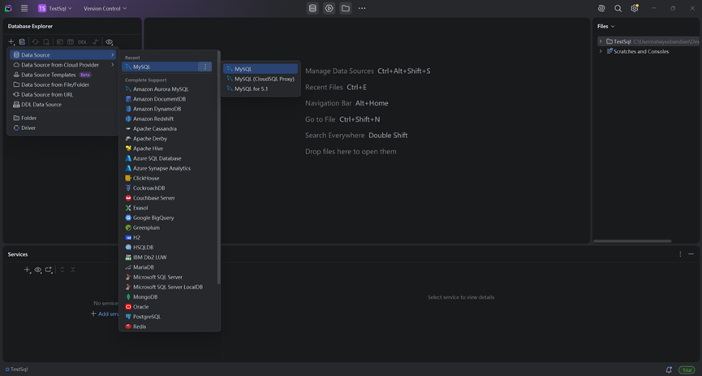
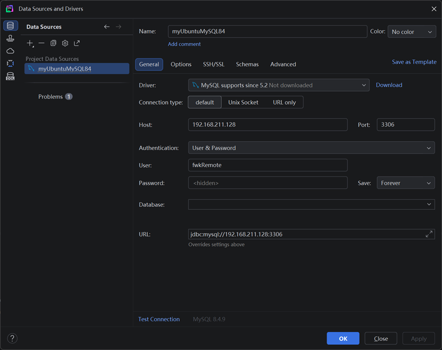

# MySQL数据库安装、连接

## Windows

✅安装

https://dev.mysql.com/downloads/mysql/

可在MySQL文件夹先创建两个文件夹 install 和 data

打开MySQL Configurator，其中：

   Data Directory可选刚创建的文件夹data

   记住端口是3306

   填MySQL Root Passward: 例如fwk123

   …其余默认

此时MySQL服务已启动


✅卸载

任务管理器——服务——MYSQL84  停止

控制面板——程序——程序和功能，右击卸载，按提示操作即可


## Linux

✅安装

```shell
sudo apt update
```

https://dev.mysql.com/downloads/repo/apt/

```shell
wget https://dev.mysql.com/get/mysql-apt-config_0.8.39-1_all.deb
sudo dpkg -i mysql-apt-config_0.8.39-1_all.deb
```

按提示选择 mysql-8.4-lts

```shell
sudo apt update
sudo apt install mysql-server -y
```

设置root密码：fwk123

启动服务

```shell
sudo systemctl start mysql
```

开机自启

```shell
sudo systemctl enable mysql
```

查看运行状态

```shell
sudo systemctl status mysql
```

看到active (running)表示正在运行

停止服务

```shell
sudo systemctl stop mysql
```


## 连接数据库

用户名是你登录的用户，主机名或者IP地址为可选项，如果是本地连接则不需要，远程连接需要填写，密码是对应用户的密码

```shell
mysql –u 用户名 [–h 主机名或者IP地址, -P 端口号] –p 密码
```

- 输入-p后可以直接跟上密码，也可以按回车，会提示你输入密码，二者都是相同的效果
- `-h 127.0.0.1` 其中“-h”是参数，“127.0.0.1” 是 IP 地址，默认本地参数可忽略
- `-P 3306` 其中“-P”是参数，“3306” 是端口号，默认本地参数可忽略

```shell
mysql -u root -p
```

```shell
mysql -h 127.0.0.1 -P 3306 -u root -p rootpassword

...
mysql>
```

只需要在`mysql>`命令中输入 SQL 语句，同时并以分号“;”结束。最后摁`Enter`键即可：

- 命令输入在`mysql>` 之后
- 用`q\`、`quit`、`exit`三种命令可以退出命令行实用程序
- 帮助命令，输入`help`或`\h`获得帮助，可以获得其它特定的命令的帮助(如，输入help select获得使用SELECT语句的帮助)


⭐使用管理工具远程连接

先创建远程用户

远程用户：fwkRemote，密码：remote

```sql
CREATE USER 'fwkRemote'@'%' IDENTIFIED BY 'remote';
```

这里是授权全部数据库的所有权限，也可以是某一个数据库或某一个数据库的某一个表，也可以是部分权限，等等

```sql
GRANT ALL PRIVILEGES ON *.* TO 'fwkRemote'@'%' WITH GRANT OPTION;
```

刷新权限，立即生效

```sql
FLUSH PRIVILEGES;
```

重启数据库

```shell
sudo systemctl restart mysql
```

开放 Ubuntu 防火墙端口，开放 3306

```shell
sudo ufw allow 3306/tcp
```


**DataGrip**

新建工程





选择schema或新建schema即可

右击新建console即可输入SQL命令了


**Navicat**

点击连接

略

点击【新建查询】编写SQL语句


# 数据库管理

## 创建数据库 

创建test数据库

```sql
CREATE DATABASE test;
```

若此数据库存在则报错，可加上IF NOT EXISTS

```sql
CREATE DATABASE IF NOT EXISTS test;
```


## 查看数据库

数据库连接成功之后，可查看当前所有存在的数据库：

```sql
SHOW DATABASES;
```


## 删除数据库

```sql
DROP DATABASE test;
```

类似的，加上IF EXISTS

```sql
DROP DATABASE IF EXISTS test;
```


## 选择数据库

选择使用test数据库，之后一系列操作即针对此数据库

```sql
USE test;
```


## 数据库存储引擎

MySQL 提供了多个存储引擎，包括处理事务安全表的引擎和处理非事务安全表的引擎。在 MySQL 中，不需要在整个服务器中使用同一种存储引擎，针对具体的要求，可以对每一个表使用不同的存储引擎。

MySQL中的数据用各种不同的技术存储在文件(或者内存)中。这些技术中的每一种技术都使用不同的存储机制、索引技巧、锁定水平并且最终提供广泛的不同的功能和能力。通过选择不同的技术，你能够获得额外的速度或者功能，从而改善你的应用的整体功能。 存储引擎就是如何存储数据、如何为存储的数据建立索引和如何更新、查询数据等技术的实现方法。

例如，如果你在研究大量的临时数据，你也许需要使用内存存储引擎。内存存储引擎能够在内存中存储所有的表格数据。又或者，你也许需要一个支持事务处理的数据库(以确保事务处理不成功时数据的回退能力)。

### InnoDB

默认


# MySQL数据类型与运算符

MySQL 常用的数据类型大致可分为：

- 数值类型：例如 `TINYINT`、`INT`、`BIGINT`、`FLOAT`、`DOUBLE`、`DECIMAL`
- 日期时间类型：例如 `YEAR`、`DATE`、`TIME`、`DATETIME`、`TIMESTAMP`
- 字符串类型：例如 `CHAR`、`VARCHAR`、`TEXT`、`ENUM`、`SET`
- 二进制类型：例如 `BIT`、`BINARY`、`VARBINARY`、`BLOB`

不同类型决定了数据的存储方式、取值范围、比较规则以及空间占用


✨选择字段类型时，通常遵循以下原则：

1. 满足业务需求即可，不要盲目选择更大的类型。
2. 能用数值类型就不要用字符串类型。
3. 定长数据优先考虑 `CHAR`，变长数据优先考虑 `VARCHAR`。
4. 金额、精确计算等场景优先使用 `DECIMAL`，避免浮点误差。
5. 日期时间信息应使用专门的时间类型，不要自行用字符串保存。
6. 文本内容较长时使用 `TEXT`，二进制大对象使用 `BLOB`。

字段类型选得合适，不仅有助于节省存储空间，也会直接影响查询效率、索引效果和后续维护成本。


## 整数类型

### TINYINT

`TINYINT` 占用 1 个字节，适合保存范围较小的整数。

常见场景：

- 性别
- 布尔状态
- 很小范围的枚举值

示例：

```sql
CREATE TABLE user_status (
  id int NOT NULL AUTO_INCREMENT,
  status tinyint NOT NULL DEFAULT 0 COMMENT '0禁用，1启用',
  PRIMARY KEY (id)
);
```

✅如果字段永远不会出现负数，可以配合 `UNSIGNED` 使用，获得更大的正数范围。


### SMALLINT

`SMALLINT` 占用 2 个字节，适合保存范围中等偏小的整数。

常见场景：

- 年份编号
- 库存数量较小的商品
- 区域编号、分类编号

示例：

```sql
CREATE TABLE course (
  id int NOT NULL AUTO_INCREMENT,
  course_no smallint unsigned NOT NULL,
  PRIMARY KEY (id)
);
```


### MEDIUMINT

`MEDIUMINT` 占用 3 个字节，介于 `SMALLINT` 和 `INT` 之间。

它在很多业务里不如 `INT` 常见，但在一些对存储空间敏感、同时数据量又超过 `SMALLINT` 范围的场景里仍然有价值。

示例：

```sql
CREATE TABLE city_stat (
  id int NOT NULL AUTO_INCREMENT,
  population mediumint unsigned NOT NULL DEFAULT 0,
  PRIMARY KEY (id)
);
```


### INT

`INT` 是**最常用**的整数类型，占用 4 个字节，适合绝大多数业务编号和计数字段。

常见场景：

- 用户 ID
- 订单 ID
- 浏览次数
- 商品数量

示例：

```sql
CREATE TABLE article (
  id int unsigned NOT NULL AUTO_INCREMENT,
  title varchar(100) NOT NULL,
  view_count int unsigned NOT NULL DEFAULT 0,
  PRIMARY KEY (id)
);
```

如果不确定用哪种整数类型，`INT` 通常是最稳妥的默认选择。


### BIGINT

`BIGINT` 占用 8 个字节，适合非常大的整数范围。

常见场景：

- 超大规模主键 ID
- 雪花算法 ID
- 金额分单位后的超大整数存储
- 高并发日志流水号

示例：

```sql
CREATE TABLE order_log (
  id bigint unsigned NOT NULL AUTO_INCREMENT,
  order_no bigint unsigned NOT NULL,
  PRIMARY KEY (id)
);
```

当数据量可能达到数十亿级时，主键通常会优先考虑 `BIGINT`。


### 小结

整数类型的核心差别在于“范围”和“空间”。范围够用即可，过大只会浪费存储；过小则可能溢出。业务里最常见的是 `TINYINT`、`INT` 和 `BIGINT`。


## 浮点数类型和定点数类型

### FLOAT

`FLOAT` 是单精度浮点数，适合对精度要求不高、但更关注存储空间和速度的场景。

常见场景：

- 温度
- 身高体重
- 近似统计值

示例：

```sql
CREATE TABLE weather (
  id int NOT NULL AUTO_INCREMENT,
  temperature float DEFAULT NULL,
  PRIMARY KEY (id)
);
```

需要注意，`FLOAT` 在计算和存储时可能出现精度误差，因此不适合保存金额等精确数据。


### DOUBLE

`DOUBLE` 是双精度浮点数，精度和范围都比 `FLOAT` 更高。

常见场景：

- 科学计算
- 更大范围的近似数值
- 对误差容忍度稍低但仍不要求绝对精确的业务

示例：

```sql
CREATE TABLE position_log (
  id int NOT NULL AUTO_INCREMENT,
  longitude double NOT NULL,
  latitude double NOT NULL,
  PRIMARY KEY (id)
);
```

`DOUBLE` 比 `FLOAT` 更精确，但本质上仍然是浮点数，也可能存在精度问题。


### DECIMAL

`DECIMAL` 是定点数类型，适合要求精确计算的场景。

最典型的场景就是：

- 金额
- 账务数据
- 税率
- 结算数据

语法通常写为：

```sql
DECIMAL(M, D)
```

其中：

- `M` 表示总位数
- `D` 表示小数位数

例如：

```sql
CREATE TABLE account (
  id int NOT NULL AUTO_INCREMENT,
  balance decimal(10,2) NOT NULL DEFAULT 0.00,
  PRIMARY KEY (id)
);
```

这里的 `decimal(10,2)` 表示总共 10 位，其中 2 位是小数位，也就是最多能表示 8 位整数加 2 位小数。


### 小结

`FLOAT` 和 `DOUBLE` 是近似值，`DECIMAL` 是精确值。只要涉及金额、结算、财务、积分等不能容忍误差的业务，应该优先使用 `DECIMAL`。


## 日期时间类型

### YEAR

`YEAR` 仅存储**年份**，格式为`YYYY`

示例：

```sql
CREATE TABLE student_profile (
  id int NOT NULL AUTO_INCREMENT,
  enroll_year year DEFAULT NULL,
  PRIMARY KEY (id)
);
```

如果字段只需要表达“年份”，使用 `YEAR` 会比字符串更清晰。


### DATE

`DATE` 仅存储**日期**（无时间），格式为`YYYY-MM-DD`

示例：

```sql
CREATE TABLE holiday (
  id int NOT NULL AUTO_INCREMENT,
  holiday_date date NOT NULL,
  PRIMARY KEY (id)
);
```


### TIME

`TIME` 仅存储**时间**（无日期），格式为`HH:MM:SS`

示例：

```sql
CREATE TABLE work_time (
  id int NOT NULL AUTO_INCREMENT,
  start_time time NOT NULL,
  PRIMARY KEY (id)
);
```


### DATETIME

`DATETIME` 存储**日期 + 时间**，格式为`YYYY-MM-DD HH:MM:SS`

示例：

```sql
CREATE TABLE article (
  id int NOT NULL AUTO_INCREMENT,
  publish_time datetime NOT NULL,
  PRIMARY KEY (id)
);
```


### TIMESTAMP

`TIMESTAMP` 同样存储**日期 + 时间**

示例：

```sql
CREATE TABLE user_log (
  id int NOT NULL AUTO_INCREMENT,
  created_at timestamp NOT NULL DEFAULT CURRENT_TIMESTAMP,
  updated_at timestamp NOT NULL DEFAULT CURRENT_TIMESTAMP
    ON UPDATE CURRENT_TIMESTAMP,
  PRIMARY KEY (id)
);
```


### ⭐DATETIME和TIMESTAMP的区别

DATETIME：保存纯字符串格式的日期时间，你插入什么，就存什么。

```sql
CREATE TABLE test_datetime (
    dt DATETIME
);

INSERT INTO test_datetime VALUES ('2026-05-26 12:00:00');
```

无论数据库时区怎么变：

```sql
SELECT dt FROM test_datetime;
```

永远都是：

```sql
2026-05-26 12:00:00
```

------

TIMESTAMP：保存“UTC时间戳”

插入时：

- 把当前会话时区转换成 UTC 保存

查询时：

- 再转换回当前会话时区显示

当前 MySQL 时区：

```sql
SET time_zone = '+08:00';
```

插入：

```sql
CREATE TABLE test_ts (
    ts TIMESTAMP
);

INSERT INTO test_ts VALUES ('2026-05-26 12:00:00');
```

实际保存的是：

```sql
2026-05-26 04:00:00 UTC
```

切换时区：

```sql
SET time_zone = '+00:00';
```

查询：

```sql
SELECT ts FROM test_ts;
```

结果变成：

```sql
2026-05-26 04:00:00
```

------

DATETIME 适合“业务时间”，即用户看到的真实时间。例如：

- 会议开始时间
- 生日
- 航班时间
- 活动时间
- 订单约定送达时间

这些时间不应该因为服务器时区变化而变化

TIMESTAMP 适合“系统时间”，系统记录行为发生的时间点。例如：

- 创建时间
- 更新时间
- 日志时间
- 数据同步时间
- 审计字段


示例

```sql
CREATE TABLE user (
    id BIGINT PRIMARY KEY,
    name VARCHAR(50),
    created_at TIMESTAMP DEFAULT CURRENT_TIMESTAMP,
    updated_at TIMESTAMP DEFAULT CURRENT_TIMESTAMP ON UPDATE CURRENT_TIMESTAMP
);
```

- 自动更新时间
- 节省空间


## 字符串类型

### CHAR和VARCHAR

`CHAR` 是定长字符串（字符长度（0~255）），固定长度存储（容易浪费存储空间），不足长度会自动补空格，查询时尾部空格通常会被忽略

例如：

- 性别（M/F）
- 身份证号
- 手机号（固定长度）
- MD5值
- 国家编码

------

`VARCHAR` 是变长字符串（最常用）（最大长度65535），按实际内容长度存储（实际占用 = 内容长度 + 1~2字节长度记录）

例如：

- 用户昵称
- 邮箱
- 地址
- 商品名称
- 评论标题

```sql
CREATE TABLE member (
  id int NOT NULL AUTO_INCREMENT,
  gender char(1) NOT NULL DEFAULT 'U',
  name varchar(50) NOT NULL,
  mobile varchar(20) NOT NULL DEFAULT '',
  PRIMARY KEY (id)
);
```


### TEXT

存储长文本

MySQL 提供 4 种 TEXT：

| 类型       | 最大长度 |
| ---------- | -------- |
| TINYTEXT   | 255B     |
| TEXT       | 64KB     |
| MEDIUMTEXT | 16MB     |
| LONGTEXT   | 4GB      |

| 问题                 | 说明             |
| -------------------- | ---------------- |
| 查询较慢             | 大对象读取成本高 |
| 不适合频繁排序       | 性能较差         |
| 默认不能有完整默认值 | 某些版本限制     |
| 索引有限制           | 需指定前缀索引   |

适合：

- 文章内容
- 富文本
- JSON文本
- 日志


### ENUM

枚举类型，字段值必须是预先定义好的若干个值之一

```sql
CREATE TABLE orders (
  id int NOT NULL AUTO_INCREMENT,
  status enum('pending', 'paid', 'closed') NOT NULL DEFAULT 'pending',
  PRIMARY KEY (id)
);
```

优点

- 节省空间
- 数据合法性强
- 查询方便

缺点

- 修改枚举值麻烦
- 扩展性差

适合

- 性别
- 状态
- 星期
- 订单状态


枚举类型限制字段只能取指定范围内的值，减少脏数据。但如果业务状态经常变化，`ENUM` 后期维护会相对麻烦。


### SET

`SET` 用于保存一组可选值中的一个或多个值。

适合的场景：

- 用户兴趣标签
- 星期选择
- 权限标记

```sql
CREATE TABLE user_tag (
  id int NOT NULL AUTO_INCREMENT,
  hobby set('music', 'movie', 'sports', 'travel') DEFAULT NULL,
  PRIMARY KEY (id)
);
```

例如一条记录可以同时保存 `music, sports` 这样的组合。


## 二进制类型

MySQL 的二进制类型（Binary Types）主要用于存储：

- 原始字节数据（bytes）
- 文件内容
- 图片/音频/视频
- 加密数据
- 哈希值
- 不需要字符集转换的数据

它和字符串类型（CHAR/VARCHAR/TEXT）最大的区别：

> 二进制类型按“字节”处理，而不是按“字符”处理。


### BINARY和VARBINARY

固定/变长长度二进制数据

示例：

```sql
CREATE TABLE api_secret (
  id int NOT NULL AUTO_INCREMENT,
  token binary(16) NOT NULL,              # 16字节
  secret varbinary(64) NOT NULL,
  PRIMARY KEY (id)
);
```

场景：

- 加密内容
- Session数据
- token

> [!NOTE]
>
> 有时存BINARY比VARCHAR更节省空间，例如UUID（128bit），128 ÷ 8 = 16 byte，BINARY(16)，刚好够存 UUID 原始值。
>
> 常见 UUID 格式：550e8400-e29b-41d4-a716-446655440000，32 个十六进制字符加上4 个 `-`
>
> BINARY(16) 存：55 0e 84 00 e2 9b 41 d4 ...，共16字节


### BLOB

存储较大的二进制对象

场景：

- 图片二进制内容
- 文件内容
- 音频片段

```sql
CREATE TABLE images (
    id INT PRIMARY KEY,
    img BLOB
);
```

```sql
INSERT INTO images VALUES (
    1,
    LOAD_FILE('/tmp/a.png')
);
```

> [!WARNING]
>
> 大对象直接存数据库虽然方便，但也可能带来备份、传输和查询性能压力，因此推荐对象存储，只在数据库里保存 URL 或元信息。


### BIT

用于存储位数据，范围：1 ~ 64

适合：

- 开关状态
- 权限标志
- 布尔组合
- 二进制位运算
- 节省存储空间

```sql
CREATE TABLE user (
    id INT,
    is_deleted BIT(1)
);
```

```sql
INSERT INTO user VALUES (1, b'0');
INSERT INTO user VALUES (2, b'1');
```

BIT 的字面量写法

二进制

```sql
INSERT INTO t VALUES (b'1010');
```

十六进制

```sql
INSERT INTO t VALUES (0x0A);
```

8位

```sql
CREATE TABLE role (
    id INT,
    permission BIT(8)
);
```

```sql
INSERT INTO role VALUES (1, b'00000111');
```

星期标记

```sql
1111100
```

表示工作日


## 运算符

### 算术运算符

常见算术运算符：

- `+`：加法
- `-`：减法
- `*`：乘法
- `/`：除法
- `%`：取余


示例：

```sql
SELECT price, quantity, price * quantity AS total_amount FROM order_item;
```


### 比较运算符

常见比较运算符：

- `=`：等于
- `<>` 或 `!=`：不等于
- `>`：大于
- `<`：小于
- `>=`：大于等于
- `<=`：小于等于


示例：

```sql
SELECT * FROM user WHERE age = 18;
SELECT * FROM user WHERE age >= 18;
SELECT * FROM user WHERE status <> 'disabled';
```

实际查询中还经常结合以下关键字：

- `BETWEEN ... AND ...`
- `IN (...)`
- `LIKE`
- `IS NULL`

例如：

```sql
SELECT * FROM orders WHERE amount BETWEEN 100 AND 500;
SELECT * FROM user WHERE city IN ('北京', '上海');
SELECT * FROM article WHERE title LIKE 'MySQL%';
SELECT * FROM profile WHERE mobile IS NULL;
```


### 逻辑运算符

常见逻辑运算符：

- `AND`：并且
- `OR`：或者
- `NOT`：非


示例：

```sql
SELECT * FROM user WHERE age >= 18 AND city = '上海';

SELECT * FROM user WHERE city = '北京' OR city = '深圳';

SELECT * FROM user WHERE NOT status = 'disabled';
```

在复杂条件中，建议适当使用括号，避免优先级造成理解偏差

```sql
SELECT * FROM user
WHERE (city = '上海' OR city = '杭州') AND status = 'enabled';
```


### 位运算符

常见位运算符：

- `&`：按位与
- `|`：按位或
- `^`：按位异或
- `~`：按位取反
- `<<`：左移
- `>>`：右移


# ⭐数据表的基本操作

## 创建数据表

一个数据库中可以包含多张表，而每张表都由**字段（列）**和**记录（行）**组成。

### 数据表结构设计

设计表结构时，需要重点考虑以下内容：

1、字段（列）存什么内容

2、选择合适的数据类型

3、是否允许 NULL，有无 DEFAULT 默认值

4、主键

5、外键，建立表与表之间的关系？

6、唯一约束（UNIQUE）

7、经常查询的字段，加索引？

8、需要 COMMENT 吗？

......


### CREATE TABLE

```sql
CREATE TABLE 表名 (
  字段名1 数据类型 [约束条件],
  字段名2 数据类型 [约束条件],
  ...
);
```

```sql
CREATE TABLE users (
    id INT PRIMARY KEY AUTO_INCREMENT,
    username VARCHAR(50) NOT NULL,
    password VARCHAR(100) NOT NULL,
    age INT,
    email VARCHAR(100) UNIQUE,
    status INT DEFAULT 1,
    created_at TIMESTAMP DEFAULT CURRENT_TIMESTAMP
);
```

| 字段       | 说明             |
| ---------- | ---------------- |
| id         | 主键约束、自增   |
| username   | 用户名，不能为空 |
| password   | 密码，不能为空   |
| age        | 年龄             |
| email      | 邮箱，唯一值     |
| status     | 默认状态1        |
| created_at | 创建时间，默认值 |


### 主键约束（PRIMARY KEY）

主键：

- 唯一
- 不可重复
- 不允许 NULL

主键：用于唯一标识表中的每一条记录，一张表只能有一个主键。

```sql
CREATE TABLE student (
    id INT PRIMARY KEY,
    name VARCHAR(50)
);
```

```sql
CREATE TABLE student (
    id INT,
    name VARCHAR(50),
    PRIMARY KEY(id)
);
```

也可以定义联合主键：多个字段共同作为主键，多个字段组合才能唯一确定某条记录

```sql
CREATE TABLE score (
  student_id int NOT NULL,
  course_id int NOT NULL,
  score decimal(5,2) DEFAULT NULL,
  PRIMARY KEY (student_id, course_id)
);
```


### ✨外键约束（FOREIGN KEY）

1、外键用于建立表与表之间的关联关系，通常引用另一张表的主键或唯一键。

2、外键保证数据引用的有效性。例如：

- 订单必须属于某个用户
- 学生必须属于某个班级

```sql
CREATE TABLE classes (
    id INT PRIMARY KEY AUTO_INCREMENT,
    class_name VARCHAR(50) NOT NULL
);
```

```sql
CREATE TABLE students (
    id INT PRIMARY KEY AUTO_INCREMENT,
    name VARCHAR(50) NOT NULL,
    class_id INT,
    
    FOREIGN KEY(class_id) REFERENCES classes(id)
);
```

students.class_id 是外键，引用 classes.id

约束效果：学生表中的班级编号必须在班级表中存在

```sql
INSERT INTO students(name, class_id)
VALUES('Tom', 10);
```

如果：classes 表中没有 id=10，报错，引用的数据不存在

------

🌠更新与删除规则

删除或更新主表记录时，从表中的关联数据自动处理

```sql
ON DELETE CASCADE
ON DELETE SET NULL
ON UPDATE CASCADE
```

```sql
CREATE TABLE classes (
    id INT PRIMARY KEY AUTO_INCREMENT,
    class_name VARCHAR(50) NOT NULL
);

CREATE TABLE students (
    id INT PRIMARY KEY AUTO_INCREMENT,
    name VARCHAR(50) NOT NULL,
    class_id INT,

    CONSTRAINT fk_class   # CONSTRAINT = 约束命名，fk_class 是给这个外键约束起的名字，方便删除此外键等
    FOREIGN KEY(class_id) REFERENCES classes(id)
    ON DELETE SET NULL
    ON UPDATE CASCADE
);
```

主表：classes，从表：students

如果某个班级被删除（id = 1），所有 `class_id = 1` 的学生的`class_id`变为 NULL 

如果某个班级的 id 发生变化，那么 students 表会自动更新 class_id


## 查看数据表结构

创建完数据表之后，通常需要确认表结构是否正确，例如字段名是否写对、数据类型是否符合预期、主键和默认值是否生效。这时就需要查看数据表结构。

```sql
DESCRIBE user;
DESC user;
```

常会返回以下几类信息：

- `Field`：字段名
- `Type`：字段类型
- `Null`：是否允许为空
- `Key`：是否为主键、索引等
- `Default`：默认值
- `Extra`：附加信息，例如 `auto_increment`

------

若还想看到完整的建表 SQL，应该使用 `SHOW CREATE TABLE`

```sql
SHOW CREATE TABLE user;
```


## 修改数据表

### 修改表名

```sql
RENAME TABLE old_table TO new_table;
```

```sql
ALTER TABLE old_table RENAME TO new_table;  # MySQL 中 RENAME TO 可简写为 RENAME
```


### 修改字段

MODIFY（只改类型或约束，不改字段名）

```sql
ALTER TABLE table_name
MODIFY COLUMN column_name new_datatype;
```

```sql
ALTER TABLE students
MODIFY COLUMN name VARCHAR(100);
```

CHANGE（可以改字段名 + 类型）

```sql
ALTER TABLE table_name
CHANGE old_column new_column new_datatype;
```

```sql
ALTER TABLE students
CHANGE name student_name VARCHAR(100);
```

注意：即使字段名不变，也要把字段名写两次；仅修改字段名，类型也要写完整。


### 添加字段

```sql
ALTER TABLE table_name
ADD COLUMN column_name datatype [约束];
```

示例：

```sql
ALTER TABLE students
ADD COLUMN age INT;
```

```sql
ALTER TABLE students
ADD COLUMN status VARCHAR(20) DEFAULT 'active';
```

默认情况下，新字段会加在表末尾。如果想指定位置，可以使用 `AFTER`：

```sql
ALTER TABLE students
ADD COLUMN email VARCHAR(100) AFTER name;
```


### 删除字段

```sql
ALTER TABLE table_name
DROP COLUMN column_name;
```


## 删除数据表

如果一张表没有被其他表通过外键关联，可以直接删除。

```sql
DROP TABLE users;
```

```sql
DROP TABLE users, orders;
```

可以使用 `IF EXISTS`

需要注意，`DROP TABLE` 会同时删除：

- 表结构
- 表中的所有数据
- 与该表直接相关的索引定义

所以和“删除表中数据”不是一回事

------

如果一张表被外键引用，直接删除会失败。

```sql
CREATE TABLE users (
    id INT PRIMARY KEY,
    name VARCHAR(50)
);

CREATE TABLE orders (
    id INT PRIMARY KEY,
    user_id INT,
    CONSTRAINT fk_orders_users
    FOREIGN KEY (user_id) REFERENCES users(id)
);
```

`users` 是主表，被引用，删除报错：

```sql
Cannot drop table 'users' referenced by a foreign key constraint
```

从表还依赖此主表，为了保证引用完整性，不允许直接删除。


常见处理方式：

1、先删除子表

```sql
DROP TABLE orders;
DROP TABLE users;
```

2、先删除外键约束

```sql
ALTER TABLE orders DROP FOREIGN KEY fk_orders_users;
DROP TABLE users;
```


------

建议：

- 备份数据
- 检查依赖
- 软删除、逻辑删除（加一个字段来表示是否删除）
- ......

```sql
CREATE TABLE users_backup AS SELECT * FROM users;   # 备份users表
```


# MySQL函数

## 数学函数

### ROUND()

`ROUND()` 用于对数字进行四舍五入。

```sql
ROUND(数字, 保留小数位数)
```

```sql
SELECT ROUND(3.6);
```

结果：

```
4
```

```sql
SELECT ROUND(3.1415926, 2);
```

结果：

```
3.14
```


### CEIL() / CEILING()

返回大于等于该数的最小整数。

```sql
CEIL(数字)
```

```sql
SELECT CEIL(3.1);
```

结果：

```
4
```


### FLOOR()

返回小于等于该数的最大整数。

```sql
FLOOR(数字)
```

```sql
SELECT FLOOR(3.9);
```

结果：

```
3
```


### RAND()

生成随机数。

```sql
RAND()
```

返回值范围：

```
0 ~ 1
```

生成随机数

```sql
SELECT RAND();
```

随机查询一条数据

```sql
SELECT * FROM student
ORDER BY RAND()
LIMIT 1;
```


## 字符串函数

### CHAR_LENGTH()

计算字符串中的字符个数。

> 中文算一个字符。

```sql
CHAR_LENGTH(字符串)
```

```sql
SELECT CHAR_LENGTH('hello');
```

结果：

```
5
```

```sql
SELECT CHAR_LENGTH('你好');
```

结果：

```
2
```


### LENGTH()

计算字符串占用的字节数。

> UTF-8 编码下，一个中文通常占 3 个字节。

```sql
LENGTH(字符串)
```

```sql
SELECT LENGTH('hello');
```

结果：

```
5
```

```sql
SELECT LENGTH('你好');
```

结果（UTF-8）：

```
6
```


### CONCAT()

用于拼接字符串。

```sql
CONCAT(字符串1, 字符串2, ...)
```

```sql
SELECT CONCAT('Hello', ' ', 'World');
```

结果：

```
Hello World
```

```sql
SELECT CONCAT(first_name, last_name)
FROM student;
```


### REPLACE()

替换字符串中的内容。

```sql
REPLACE(原字符串, 被替换内容, 新内容)
```

```sql
SELECT REPLACE('I like C++', 'C++', 'MySQL');
```

结果：

```
I like MySQL
```


### STRCMP()

比较两个字符串。

```sql
STRCMP(字符串1, 字符串2)
```

返回值：

| 返回值 | 说明         |
| ------ | ------------ |
| 0      | 相等         |
| 1      | 前者大于后者 |
| -1     | 前者小于后者 |


```sql
SELECT STRCMP('abc', 'abc');
```

结果：

```sql
0
SELECT STRCMP('bcd', 'abc');
```

结果：

```
1
```


### INSTR()

查找子字符串首次出现的位置。

没找到通常返回 0

```sql
INSTR(原字符串, 子字符串)
```

```sql
SELECT INSTR('Hello MySQL', 'MySQL');
```

结果：

```
7
```


## 日期时间函数

### NOW()

返回当前日期和时间。

```sql
NOW()
```

```sql
SELECT NOW();
```

结果：

```
2026-05-27 10:30:00
```


### DATE_FORMAT()

按指定格式显示日期。

```
DATE_FORMAT(日期, 格式)
```

常用格式符

| 格式符 | 说明     |
| ------ | -------- |
| %Y     | 四位年份 |
| %m     | 两位月份 |
| %d     | 两位日期 |
| %H     | 小时     |
| %i     | 分钟     |
| %s     | 秒       |

示例1：格式化日期

```sql
SELECT DATE_FORMAT(NOW(), '%Y-%m-%d');
```

结果：

```
2026-05-27
```

示例2：格式化时间

```sql
SELECT DATE_FORMAT(NOW(), '%Y年%m月%d日 %H:%i:%s');
```

结果：

```
2026年05月27日 10:30:00
```


## 条件判断函数

### IF() 

类似程序中的 if-else。

```sql
IF(条件, 真值, 假值)
```

```sql
SELECT IF(80 >= 60, '及格', '不及格');
```

结果：

```
及格
```


### IFNULL()

判断是否为 NULL。

```sql
IFNULL(值, 替换值)
```

```sql
SELECT IFNULL(NULL, '默认值');
```

结果：

```
默认值
```


### CASE WHEN

实现多条件判断。

```sql
CASE
    WHEN 条件1 THEN 结果1
    WHEN 条件2 THEN 结果2
    ELSE 默认结果
END
```

```sql
SELECT name, score,
       CASE
           WHEN score >= 90 THEN '优秀'
           WHEN score >= 60 THEN '及格'
           ELSE '不及格'
       END AS grade
FROM student;
```


## 加密函数

### PASSWORD() 

```sql
PASSWORD(字符串)
```

```sql
SELECT PASSWORD('123456');
```


`PASSWORD()` 是 MySQL 内部认证函数。在 MySQL 8.0 中已经不推荐开发中使用。


### MD5() 

生成 32 位十六进制字符串

`MD5` 已经不适合用于高安全要求的密码存储，只适合做一般性的摘要或兼容旧系统

```sql
MD5(字符串)
```

```sql
SELECT MD5('123456');
```

结果：

```
e10adc3949ba59abbe56e057f20f883e 
```


### ENCODE和DECODE

用于按指定密码对字符串进行编码和解码

```sql
SELECT ENCODE('hello', 'key123');
SELECT DECODE(ENCODE('hello', 'key123'), 'key123');
```

对低敏感内容做简单隐藏

对于真正的安全场景，例如密码、密钥、用户隐私数据，不能依赖这类简单函数作为完整安全方案


### 建议

- 密码不要明文存储。
- 不要把 `MD5()` 当作高安全密码方案。
- 不要把 `PASSWORD()` 当作业务密码存储方式。
- 更高安全需求应交给应用层成熟加密库处理。


# ⭐⭐⭐查询数据

## SELECT 基本语法

指定要查询的字段

```sql
SELECT 字段名
FROM 表名
[WHERE 条件];
```

查询学生姓名和年龄：

```sql
SELECT name, age
FROM students;
```

可使用 `*` 表示查询表中的所有字段

```sql
SELECT * FROM 表名;
```

使用 `WHERE` 设置条件

```sql
SELECT *
FROM students
WHERE age = 18;

SELECT name
FROM students
WHERE city = 'Shanghai';
```


## 别名

别名用于给字段、表达式或表临时起一个更容易理解的名字，只在当前 SQL 语句中生效，不会修改真实的字段名或表名。

常用关键字是 `AS`，也可以省略。

### 字段别名

字段别名常用于让查询结果更清晰。

```sql
SELECT 字段名 AS 别名
FROM 表名;
```

查询学生姓名和年龄，并给字段起中文别名：

```sql
SELECT name AS 姓名, age AS 年龄
FROM students;
```

`AS` 可以省略：

```sql
SELECT name 姓名, age 年龄
FROM students;
```

如果别名中有空格或特殊字符，可以使用反引号：

```sql
SELECT name AS `student name`
FROM students;
```


### 表达式别名

表达式别名常用于计算字段。

```sql
SELECT product_name,
       price,
       quantity,
       price * quantity AS total_amount
FROM order_item;
```

这里 `total_amount` 不是表中真实存在的字段，而是查询时临时计算出来的结果名。

聚合函数也经常使用别名：

```sql
SELECT dept, COUNT(*) AS total
FROM employees
GROUP BY dept;
```


### 表别名

表别名常用于多表查询，可以让 SQL 更简洁。

```sql
SELECT s.name, c.class_name
FROM students AS s
JOIN classes AS c
ON s.class_id = c.id;
```

说明：

- `students AS s`：给 `students` 表起别名 `s`
- `classes AS c`：给 `classes` 表起别名 `c`
- 后面可以用 `s.name`、`c.class_name` 引用字段

表别名也可以省略 `AS`：

```sql
SELECT s.name, c.class_name
FROM students s
JOIN classes c
ON s.class_id = c.id;
```

注意：一旦给表起了别名，在当前 SQL 中通常就要使用别名引用字段，不要再混用原表名。

```sql
SELECT students.name
FROM students AS s;
```

上面这种写法容易报错，因为表已经被临时命名为 `s`。


## IN、BETWEEN AND、LIKE

`IN` 用于匹配多个值，相当于多个 `OR`。

```sql
SELECT 字段名
FROM 表名
WHERE 字段名 IN (值1, 值2, ...);
```

查询来自北京和上海的学生：

```sql
SELECT *
FROM students
WHERE city IN ('Beijing', 'Shanghai');
```

------

`BETWEEN AND` 用于查询某个范围内的数据（包含**边界值**）。

```sql
SELECT 字段名
FROM 表名
WHERE 字段名 BETWEEN 值1 AND 值2;
```

查询年龄在18到20之间的学生：

```sql
SELECT *
FROM students
WHERE age BETWEEN 18 AND 20;
```

------

`LIKE`关键字用于**模糊匹配**字符串，结合通配符使用

| 通配符 | 含义         |
| ------ | ------------ |
| `%`    | 任意多个字符 |
| `_`    | 任意一个字符 |

查询名字以 T 开头的学生

```sql
SELECT *
FROM students
WHERE name LIKE 'T%';
```

查询名字包含 a 的学生

```sql
SELECT *
FROM students
WHERE name LIKE '%a%';
```

查询名字长度为4个字符的学生

```sql
SELECT *
FROM students
WHERE name LIKE '____';
```


## ORDER BY

在 MySQL 中，可以使用 `ORDER BY` 对查询结果进行排序。

```sql
SELECT 字段名
FROM 表名
ORDER BY 字段名;
```

默认升序

```sql
SELECT *
FROM students
ORDER BY age ASC;        # ASC 表示升序，可省略
```

```sql
SELECT *
FROM students
ORDER BY score DESC;
```

先按成绩降序，再按年龄升序（成绩相同的）

```sql
SELECT *
FROM students
ORDER BY score DESC, age ASC;
```

通常配合条件查询

```sql
SELECT *
FROM students
WHERE age > 18
ORDER BY score DESC;
```


## LIMIT

在 MySQL 中，可以使用 `LIMIT` 来限制查询结果返回的行数，常用于分页、取前几条数据等场景。

```sql
SELECT 字段名
FROM 表名
LIMIT 数量;
```

只查询前 3 条记录

```sql
SELECT *
FROM students
LIMIT 3;
```

查询成绩最高的 3 名学生

```sql
SELECT *
FROM students
WHERE score > 75
ORDER BY score DESC
LIMIT 3;
```

------

LIMIT 分页查询

```sql
SELECT *
FROM 表名
LIMIT 起始位置, 数量;
```

起始位置（从 0 开始），返回多少条

第1页（前3条）

```sql
SELECT *
FROM students
LIMIT 0, 3;
```

第2页（第4~6条）

```sql
SELECT *
FROM students
LIMIT 3, 3;
```


## 聚合函数

`COUNT()` 用于统计记录数量

```sql
SELECT COUNT(*)
FROM students;
```

统计某字段非空数量

只统计 score 不为 NULL 的记录：

```sql
SELECT COUNT(score)
FROM students;
```

------

`SUM()` 用于求和

```sql
SELECT SUM(score)
FROM students;
```

```sql
SELECT SUM(score)
FROM students
WHERE age >= 19;
```

------

`AVG()` 用于计算平均值

```sql
SELECT AVG(price) AS avg_price
FROM product;
```

------

`MAX()` 用于获取最大值，`MIN()` 用于获取最小值

```sql
SELECT MAX(price) AS max_price
FROM product;

SELECT MIN(price) AS min_price
FROM product;
```


## GROUP BY 分组查询

`GROUP BY` 用于按某个字段进行分组，再对分组进行统计

```sql
SELECT 字段名, 聚合函数(字段名)
FROM 表名
GROUP BY 字段名;
```

例，统计每个部门的人数：

```sql
SELECT dept, COUNT(*) AS total
FROM employee
GROUP BY dept;
```

结果：

| dept   | total |
| ------ | ----- |
| 技术部 | 2     |
| 市场部 | 2     |
| 财务部 | 1     |

统计每个部门工资总和：

```sql
SELECT dept, SUM(salary) AS total_salary
FROM salary
GROUP BY dept;
```

------

多字段`GROUP BY`

先按部门分组，再按性别分组

```sql
SELECT dept, gender, COUNT(*)
FROM employee
GROUP BY dept, gender;
```

结果：

| dept   | gender | COUNT(*) |
| ------ | ------ | -------- |
| 技术部 | 男     | 2        |
| 技术部 | 女     | 1        |
| 市场部 | 男     | 1        |
| 市场部 | 女     | 2        |
| 财务部 | 男     | 1        |


## HAVING 分组后过滤

`HAVING` 用于对`GROUP BY`分组后的结果进行过滤。

注意：

- `WHERE`：分组前过滤
- `HAVING`：分组后过滤

```sql
SELECT 字段名, 聚合函数(字段名)
FROM 表名
GROUP BY 字段名
HAVING 条件;
```

例，查询人数大于 1 的部门：

```sql
SELECT dept, COUNT(*) AS total
FROM employee
GROUP BY dept
HAVING COUNT(*) > 1;
```

结果：

| dept   | total |
| ------ | ----- |
| 技术部 | 2     |
| 市场部 | 2     |

例，查询工资大于 8000 的员工中，每个部门的平均工资，并且平均工资大于 10000：

```sql
SELECT dept, AVG(salary) AS avg_salary
FROM salary
WHERE salary > 8000
GROUP BY dept
HAVING AVG(salary) > 10000;
```


## JOIN 关联查询

在 MySQL 中，`JOIN` 用来把多个表的数据按照某种关联条件组合起来。

最常见的场景：

- 用户表 + 订单表
- 学生表 + 成绩表
- 商品表 + 分类表

JOIN 的核心思想：

> 用两个表中“有关联关系的字段”进行匹配。


用户表 users

| id   | name | city_id |
| ---- | ---- | ------- |
| 1    | 张三 | 1       |
| 2    | 李四 | 2       |
| 3    | 王五 | 3       |
| 4    | 赵六 | NULL    |

城市表 cities

| id   | city_name |
| ---- | --------- |
| 1    | 北京      |
| 2    | 上海      |
| 4    | 深圳      |

users.city_id 对应 cities.id


### INNER JOIN

只返回两张表中能够成功匹配的数据。

```sql
SELECT 字段
FROM 表1
INNER JOIN 表2   # 可简写为 JOIN
ON 关联条件;
```

这里 ON 用于指定表之间如何关联

示例：

```sql
SELECT
    users.name,
    cities.city_name
FROM users
INNER JOIN cities
ON users.city_id = cities.id;
```

结果：

| name | city_name |
| ---- | --------- |
| 张三 | 北京      |
| 李四 | 上海      |

------

可以连续 JOIN 多张表

```sql
SELECT
    users.name,
    products.product_name
FROM orders
JOIN users
ON orders.user_id = users.id
JOIN products
ON orders.product_id = products.id;
```

一般 FROM 什么就 ON 什么，清晰

------

复合条件 JOIN

```sql
SELECT
    orders.order_id,
    orders.amount,
    vip_users.vip_level
FROM orders
JOIN vip_users
ON orders.user_id = vip_users.user_id
AND orders.shop_id = vip_users.shop_id;
```


### LEFT JOIN

返回左边表的所有数据，即使右边表没有匹配，也会保留（使用 NULL 填充）。

```sql
SELECT 字段
FROM 表1
LEFT JOIN 表2
ON 关联条件;
```

```sql
SELECT
    users.name,
    cities.city_name
FROM users
LEFT JOIN cities
ON users.city_id = cities.id;
```

结果：

| name | city_name |
| ---- | --------- |
| 张三 | 北京      |
| 李四 | 上海      |
| 王五 | NULL      |
| 赵六 | NULL      |

users 表中的：

- 张三
- 李四
- 王五
- 赵六

全部都会出现，id 没有匹配的使用 NULL 代替。


### RIGHT JOIN

返回右边表的所有数据，即使左边表没有匹配，也会保留（使用 NULL 填充）。

```sql
SELECT 字段
FROM 表1
RIGHT JOIN 表2
ON 关联条件;
```

```sql
SELECT
    users.name,
    cities.city_name
FROM users
RIGHT JOIN cities
ON users.city_id = cities.id;
```

结果：

| name | city_name |
| ---- | --------- |
| 张三 | 北京      |
| 李四 | 上海      |
| NULL | 深圳      |

cities 表中的深圳，id=4，users 中没人引用，但 RIGHT JOIN 必须保留右边表全部数据，所以 users.name 用 NULL 填充。


## 子查询

在一个 SQL 语句内部，再嵌套一个 SELECT 查询

```sql
SELECT ...
FROM ...
WHERE 字段 IN (
    SELECT ...
)
```

示例，查询工资高于平均工资的员工

```sql
SELECT *
FROM employee
WHERE salary > (
    SELECT AVG(salary)
    FROM employee
);
```

先执行子查询 AVG

------

带 IN

示例，查询技术部员工

```sql
SELECT *
FROM employee
WHERE dept_id IN (
    SELECT dept_id
    FROM department
    WHERE dept_name = '技术部'
);
```

------

带 ANY 或 SOME（等价）

只要满足子查询结果中的任意一个值即可

```sql
字段 比较运算符 ANY (子查询)
```

查询工资高于“技术部任意一个员工”的员工

```sql
SELECT *
FROM employee
WHERE salary > ANY (
    SELECT salary
    FROM employee
    WHERE dept_id = 1
);
```

------

带 ALL

必须满足子查询中的所有值

```sql
字段 比较运算符 ALL (子查询)
```

查询工资高于“技术部所有员工”的员工

```sql
SELECT *
FROM employee
WHERE salary > ALL (
    SELECT salary
    FROM employee
    WHERE dept_id = 1
);
```

------

带 EXISTS

判断子查询是否有结果，有则 TRUE，无则 FALSE

```sql
SELECT ...
WHERE EXISTS (
    子查询
);
```

查询存在员工的部门

```sql
SELECT *
FROM department d
WHERE EXISTS (
    SELECT 1               # 返回一个常量值 1，但实际上这个值不会被使用。不关心返回什么字段值，只是检查记录是否存在
    FROM employee e
    WHERE e.dept_id = d.dept_id
);
```

查询没有员工的部门

```sql
SELECT *
FROM department d
WHERE NOT EXISTS (
    SELECT 1
    FROM employee e
    WHERE e.dept_id = d.dept_id
);
```

子查询也可以放在 FROM 中

查询各部门平均工资

```sql
SELECT dept_avg.dept_id,
       dept_avg.avg_salary
FROM (
    SELECT dept_id,
           AVG(salary) AS avg_salary
    FROM employee
    GROUP BY dept_id
) AS dept_avg;
```


## UNION 合并/联合查询

UNION 和 UNION ALL 用于合并多个 SELECT 查询结果

UNION 将多个查询结果合并，并且**自动去重**，UNION ALL 不去重。

注意：多个 SELECT 必须满足列数相同且数据类型兼容

```sql
SELECT column1, column2, ...
FROM table1

UNION / UNION ALL

SELECT column1, column2, ...
FROM table2;
```


# ⭐插入、更新与删除数据

## INSERT

插入所有字段

```sql
INSERT INTO 表名
VALUES (值1, 值2, 值3, ...);
```

注意：

- 值的顺序必须和表中字段顺序一致
- 字段数量和值数量必须一致

```sql
CREATE TABLE student (
    id INT,
    name VARCHAR(20),
    age INT,
    gender VARCHAR(10)
);
```

```sql
INSERT INTO student
VALUES (1, 'Tom', 20, '男');
```

------

指定字段插入

```sql
INSERT INTO 表名 (字段1, 字段2, ...)
VALUES (值1, 值2, ...);
```

特点：

- 只给指定字段赋值
- 未赋值字段会使用默认值
- 更推荐这种写法，可读性更高

```sql
INSERT INTO student (name, age)
VALUES ('Alice', 18);
```

------

插入多条记录

```sql
INSERT INTO 表名
VALUES
(值1, 值2, ...),
(值1, 值2, ...),
(值1, 值2, ...);
```

```sql
INSERT INTO student
VALUES
(2, 'Jack', 21, '男'),
(3, 'Rose', 19, '女'),
(4, 'Lucy', 22, '女');
```

------

插入查询结果

```sql
INSERT INTO 表名1
SELECT ...
FROM 表名2
WHERE 条件;
```

将年龄小于等于 20 的学生插入优秀学生表

```sql
CREATE TABLE good_student (
    id INT,
    name VARCHAR(20),
    age INT,
    gender VARCHAR(10)
);
```

```sql
INSERT INTO good_student
SELECT *
FROM student
WHERE age <= 20;
```

指定字段 + 查询结果插入

```sql
INSERT INTO 表名 (字段1, 字段2)
SELECT 字段1, 字段2
FROM 其他表;
```


## UPDATE

更新单个字段

```sql
UPDATE 表名
SET 字段名 = 新值
WHERE 条件;
```

说明：

- `SET`：指定要修改的字段
- `WHERE`：指定修改哪些记录
- 如果没有 `WHERE`，会修改整张表、

------

更新多个字段

```sql
UPDATE 表名
SET 字段1 = 值1,
    字段2 = 值2,
    ...
WHERE 条件;
```

```sql
UPDATE student
SET age = 19,
    gender = '女'
WHERE name = 'Alice';
```

------

更新所有记录（修改整张表）

```sql
UPDATE 表名
SET 字段 = 值;
```

把所有学生年龄加 1：

```sql
UPDATE student
SET age = age + 1;       # 可使用表达式
```

------

根据查询结果更新

```sql
UPDATE 表1
SET 字段 = (
    SELECT ...
)
WHERE 条件;
```

```sql
UPDATE class_info
SET avg_age = (
    SELECT AVG(age)
    FROM student
);
```

------

关联表更新

```sql
UPDATE 表1
JOIN 表2
ON 关联条件
SET 表1.字段 = 值
WHERE 条件;
```

```sql
UPDATE student s
JOIN class c
ON s.class_id = c.class_id
SET s.name = CONCAT(s.name, '_A')
WHERE c.class_name = '一班';
```


## DELETE

删除指定数据

```sql
DELETE FROM 表名
WHERE 条件;
```

```sql
DELETE FROM student
WHERE id = 1;

DELETE FROM student
WHERE gender = '男' AND age < 22;
```

------

删除所有记录

```sql
DELETE FROM 表名;
```

说明：

- 删除表中的所有记录
- 表结构仍然保留


# 事务与锁基础

## 事务 Transaction

事务是数据库中**一组逻辑相关的操作**，这些操作要么全部成功执行，要么全部不执行。

可以把事务理解成一个整体任务，例如银行转账：

1. A账户扣款100元
2. B账户加款100元

这两个操作必须同时成功，否则会造成数据错误。

------

事务四大特性

1、Atomicity（原子性）

事务是不可分割的最小工作单元。要么全部成功，要么全部失败。

2、Consistency（一致性）

事务执行前后，数据库必须保持一致状态。

3、Isolation（隔离性）

多个事务并发执行时，互不干扰。

4、Durability（持久性）

事务一旦提交，数据永久保存。

------

开启事务

```sql
START TRANSACTION;
```

提交事务

```sql
COMMIT;
```

回滚事务

```sql
ROLLBACK;
```

示例，转账100元：

```sql
START TRANSACTION;

UPDATE account
SET balance = balance - 100
WHERE id = 1;

UPDATE account
SET balance = balance + 100
WHERE id = 2;

COMMIT;
```

```sql
START TRANSACTION;

UPDATE account
SET balance = balance - 100
WHERE id = 1;

-- 发现异常

ROLLBACK;
```


# ⭐索引

## 索引简介

索引（Index）是帮助 MySQL 快速定位数据的一种数据结构，可以理解成一本书的目录。

没有索引时，MySQL 可能需要从第一行一直扫描到最后一行；有合适索引时，可以先通过索引找到目标记录的位置，再读取数据。

示例，假设 `users` 表有 100 万条数据：

```sql
SELECT *
FROM users
WHERE username = 'zhangsan';
```

如果 `username` 没有索引，可能会全表扫描。

如果给 `username` 建索引：

```sql
CREATE INDEX idx_users_username
ON users(username);
```

再按 `username` 查询时，MySQL 通常可以通过索引更快找到记录。

------

索引的优点：

- 提高查询速度
- 提高排序、分组、连接查询的效率
- 唯一索引可以保证字段值不重复

索引的缺点：

- 索引需要占用额外存储空间
- 插入、更新、删除数据时，索引也要维护，写入速度可能变慢
- 索引太多会增加优化器选择成本，也会让表结构更难维护

所以索引不是越多越好，而是要给**经常用于查询条件、排序、分组、连接**的字段建立合适索引。


## 索引的分类

### 普通索引

普通索引只用于提高查询速度，不要求字段值唯一。

```sql
CREATE INDEX idx_users_age
ON users(age);
```

适合查询：

```sql
SELECT *
FROM users
WHERE age = 20;
```


### 唯一索引

唯一索引要求索引列的值不能重复，但可以有 `NULL` 值。

```sql
CREATE UNIQUE INDEX idx_users_email
ON users(email);
```

适合邮箱、手机号、身份证号等不能重复的字段。

```sql
INSERT INTO users(username, password, email)
VALUES ('lisi', '123456', 'lisi@example.com');
```

如果再次插入相同邮箱，就会报错。


### 主键索引

主键索引是一种特殊的唯一索引，要求字段值唯一且不能为 `NULL`。一张表只能有一个主键。

```sql
CREATE TABLE students (
    id INT PRIMARY KEY AUTO_INCREMENT,
    name VARCHAR(50) NOT NULL,
    age INT
);
```

按主键查询通常非常快：

```sql
SELECT *
FROM students
WHERE id = 10;
```


### 联合索引

联合索引是给多个字段一起建立索引。

```sql
CREATE INDEX idx_orders_user_status_time
ON orders(user_id, status, created_at);
```

适合这种查询：

```sql
SELECT *
FROM orders
WHERE user_id = 1
  AND status = 'PAID'
ORDER BY created_at DESC;
```

联合索引要注意**最左前缀原则**。

例如索引是：

```sql
CREATE INDEX idx_user_status_time
ON orders(user_id, status, created_at);
```

可以较好使用索引的写法：

```sql
WHERE user_id = 1;

WHERE user_id = 1 AND status = 'PAID';

WHERE user_id = 1 AND status = 'PAID' AND created_at >= '2026-01-01';
```

不容易完整使用该联合索引的写法：

```sql
WHERE status = 'PAID';

WHERE created_at >= '2026-01-01';
```

因为跳过了联合索引最左边的 `user_id`。


### 全文索引

全文索引用于文本内容搜索，适合文章标题、正文、商品描述等长文本字段。

```sql
CREATE TABLE articles (
    id INT PRIMARY KEY AUTO_INCREMENT,
    title VARCHAR(100),
    content TEXT,
    FULLTEXT INDEX ft_articles_content(content)
);
```

查询示例：

```sql
SELECT *
FROM articles
WHERE MATCH(content) AGAINST('MySQL 索引');
```

普通的 `LIKE '%关键词%'` 往往很难使用 B-Tree 索引，而全文索引更适合做关键词检索。


### 前缀索引

如果字段很长，例如 `VARCHAR(255)`、`TEXT`，可以只给前面一部分字符建立索引，减少索引空间。

```sql
CREATE INDEX idx_articles_title_prefix
ON articles(title(20));
```

含义：只使用 `title` 前 20 个字符建立索引。

适合字段前缀区分度较高的场景，例如 URL、标题、编码等。


### 降序索引

降序索引适合经常按某个字段倒序排序的查询。

```sql
CREATE INDEX idx_orders_created_at_desc
ON orders(created_at DESC);
```

查询示例：

```sql
SELECT *
FROM orders
ORDER BY created_at DESC
LIMIT 10;
```

如果查询经常取“最新的 10 条订单”，降序索引可以帮助 MySQL 更快完成排序和限制返回。


## 创建索引

### 创建表时创建索引

```sql
CREATE TABLE products (
    id INT PRIMARY KEY AUTO_INCREMENT,
    product_name VARCHAR(100) NOT NULL,
    category_id INT NOT NULL,
    price DECIMAL(10, 2),
    stock INT DEFAULT 0,
    created_at DATETIME DEFAULT CURRENT_TIMESTAMP,
    UNIQUE INDEX idx_products_name(product_name),
    INDEX idx_products_category(category_id),
    INDEX idx_products_price_created(price, created_at)
);
```

说明：

- `PRIMARY KEY`：主键索引
- `UNIQUE INDEX`：唯一索引，商品名不能重复
- `INDEX`：普通索引
- `(price, created_at)`：联合索引


### 在已有表上创建索引

方式一，使用 `CREATE INDEX`：

```sql
CREATE INDEX idx_users_city
ON users(city);
```

方式二，使用 `ALTER TABLE`：

```sql
ALTER TABLE users
ADD INDEX idx_users_city_age(city, age);
```

创建唯一索引：

```sql
ALTER TABLE users
ADD UNIQUE INDEX idx_users_phone(phone);
```

创建前缀索引：

```sql
ALTER TABLE users
ADD INDEX idx_users_email_prefix(email(10));
```


## 查看索引

查看某张表已有索引：

```sql
SHOW INDEX FROM users;
```

也可以使用：

```sql
SHOW KEYS FROM users;
```

常见字段说明：

- `Key_name`：索引名称
- `Column_name`：索引包含的字段
- `Non_unique`：是否允许重复，`0` 表示唯一，`1` 表示可以重复
- `Seq_in_index`：字段在联合索引中的顺序
- `Cardinality`：索引区分度估计值，越大通常说明区分度越高


## 删除索引

删除普通索引或唯一索引：

```sql
DROP INDEX idx_users_city
ON users;
```

也可以使用：

```sql
ALTER TABLE users
DROP INDEX idx_users_city_age;
```

删除主键索引：

```sql
ALTER TABLE students
DROP PRIMARY KEY;
```

注意：如果主键字段是 `AUTO_INCREMENT`，一般不能直接删除主键，需要先处理自增属性或重新设计主键。


## 索引的设计原则

### 给高频查询字段建索引

经常出现在 `WHERE`、`JOIN ON`、`ORDER BY`、`GROUP BY` 中的字段适合建立索引。

```sql
SELECT *
FROM orders
WHERE user_id = 1001
ORDER BY created_at DESC;
```

可以建立联合索引：

```sql
CREATE INDEX idx_orders_user_time
ON orders(user_id, created_at DESC);
```


### 给区分度高的字段建索引

区分度高，表示字段值重复少。

适合建索引：

- 用户名
- 邮箱
- 手机号
- 订单号

不太适合单独建索引：

- 性别
- 是否删除
- 是否启用

例如 `gender` 只有“男、女”两个值，单独建索引效果通常不好：

```sql
CREATE INDEX idx_users_gender
ON users(gender);
```

如果业务查询经常同时按城市、性别、年龄筛选，可以考虑联合索引：

```sql
CREATE INDEX idx_users_city_gender_age
ON users(city, gender, age);
```


### 联合索引字段顺序要结合查询条件

联合索引不是简单地把字段堆在一起，要看实际 SQL。

例如常见查询：

```sql
SELECT *
FROM orders
WHERE user_id = 1
  AND status = 'PAID'
ORDER BY created_at DESC;
```

推荐：

```sql
CREATE INDEX idx_orders_user_status_time
ON orders(user_id, status, created_at DESC);
```

原因：

- `user_id` 用于筛选某个用户
- `status` 继续缩小范围
- `created_at DESC` 配合排序


### 不要给频繁更新的字段随意建索引

索引会提高查询速度，但会增加写入成本。

如果某个字段频繁变化，例如库存、余额、登录次数：

```sql
UPDATE products
SET stock = stock - 1
WHERE id = 10;
```

如果 `stock` 上有索引，每次修改库存时都要维护索引。只有当它确实经常作为查询条件时，才考虑建立索引。


### 控制索引数量

一张表不要无脑给每个字段都建索引。

例如下面这样通常没有必要：

```sql
CREATE INDEX idx_users_username ON users(username);
CREATE INDEX idx_users_email ON users(email);
CREATE INDEX idx_users_phone ON users(phone);
CREATE INDEX idx_users_age ON users(age);
CREATE INDEX idx_users_gender ON users(gender);
CREATE INDEX idx_users_status ON users(status);
```

应该根据真实查询决定索引，而不是根据字段数量决定索引。


## 索引失效的常见情况

### 对索引列使用函数

```sql
SELECT *
FROM users
WHERE YEAR(created_at) = 2026;
```

如果 `created_at` 有索引，上面写法也可能无法很好使用索引，因为对字段做了函数计算。

可以改成范围查询：

```sql
SELECT *
FROM users
WHERE created_at >= '2026-01-01'
  AND created_at < '2027-01-01';
```


### LIKE 以通配符开头

```sql
SELECT *
FROM users
WHERE username LIKE '%san';
```

这种写法前面是不确定的，普通 B-Tree 索引通常很难发挥作用。

可以使用右侧模糊匹配：

```sql
SELECT *
FROM users
WHERE username LIKE 'zhang%';
```


### 隐式类型转换

如果 `phone` 是字符串类型：

```sql
phone VARCHAR(20)
```

查询时不要写成数字：

```sql
SELECT *
FROM users
WHERE phone = 13800138000;
```

推荐写成字符串：

```sql
SELECT *
FROM users
WHERE phone = '13800138000';
```

字段类型和查询值类型保持一致，更利于索引使用。


### OR 条件使用不当

```sql
SELECT *
FROM users
WHERE username = 'zhangsan'
   OR age = 20;
```

如果 `username` 有索引，但 `age` 没有索引，优化器可能放弃使用索引。

可以根据实际情况给两个字段都建立索引，或者改写 SQL：

```sql
SELECT *
FROM users
WHERE username = 'zhangsan'
UNION
SELECT *
FROM users
WHERE age = 20;
```


## 使用 EXPLAIN 分析索引

`EXPLAIN` 可以查看 SQL 的执行计划，判断有没有使用索引。

```sql
EXPLAIN
SELECT *
FROM users
WHERE username = 'zhangsan';
```

需要重点关注：

- `type`：访问类型，常见有 `ALL`、`index`、`range`、`ref`、`const`
- `possible_keys`：可能使用的索引
- `key`：实际使用的索引
- `rows`：预计扫描行数
- `Extra`：额外信息，例如 `Using index`、`Using where`、`Using filesort`

示例：

```sql
CREATE INDEX idx_users_username
ON users(username);

EXPLAIN
SELECT *
FROM users
WHERE username = 'zhangsan';
```

如果 `key` 显示 `idx_users_username`，说明实际使用了这个索引。

如果 `type` 是 `ALL`，通常表示全表扫描，需要检查查询条件和索引设计。


## 小结

1、索引可以提高查询速度，但会占用空间并降低部分写入性能。

2、常见索引包括普通索引、唯一索引、主键索引、联合索引、全文索引、前缀索引、降序索引。

3、联合索引要注意最左前缀原则。

4、经常用于查询、排序、分组、连接的字段适合建立索引。

5、区分度太低、频繁更新、很少查询的字段不适合随意建立索引。

6、使用 `EXPLAIN` 可以判断 SQL 是否真的用到了索引。


# 存储过程和函数


# 视图


# 触发器


# MySQL用户管理


# 数据备份与还原


# MySQL日志

## 日志简介

MySQL 日志用于记录数据库运行过程中的重要信息，可以帮助我们排查错误、分析性能、审计 SQL、恢复数据。

常见日志类型：

| 日志类型 | 作用 |
| -------- | ---- |
| 错误日志 | 记录 MySQL 启动、停止、运行错误等信息 |
| 二进制日志 | 记录会修改数据的 SQL，用于数据恢复和主从复制 |
| 通用查询日志 | 记录客户端连接和执行过的 SQL |
| 慢查询日志 | 记录执行时间超过阈值的 SQL，用于性能优化 |
| 中继日志 | 主从复制中，从库接收主库二进制日志后保存的日志 |
| 重做日志 | InnoDB 用于崩溃恢复，保证事务持久性 |
| 回滚日志 | InnoDB 用于事务回滚和 MVCC |

学习阶段重点掌握：**错误日志、二进制日志、通用查询日志、慢查询日志**。


## 二进制日志

二进制日志（Binary Log，简称 binlog）记录会导致数据发生变化的操作，例如 `INSERT`、`UPDATE`、`DELETE`、`CREATE TABLE`、`DROP TABLE` 等。

主要用途：

- 数据恢复
- 主从复制
- 审计数据变更

注意：二进制日志不记录普通的 `SELECT` 查询。


### 查看二进制日志是否开启

```sql
SHOW VARIABLES LIKE 'log_bin';
```

如果结果为 `ON`，表示二进制日志已开启。

查看二进制日志文件名：

```sql
SHOW BINARY LOGS;
```

查看当前正在使用的二进制日志：

```sql
SHOW MASTER STATUS;
```

在较新的 MySQL 版本中，也可以使用：

```sql
SHOW BINARY LOG STATUS;
```


### 启动二进制日志

可以在 MySQL 配置文件中设置，例如 Linux 常见配置文件：

```ini
[mysqld]
server-id=1
log-bin=mysql-bin
binlog_format=ROW
```

说明：

- `server-id`：服务器编号，主从复制时必须唯一
- `log-bin`：开启二进制日志，并设置日志文件名前缀
- `binlog_format`：二进制日志格式

修改配置后需要重启 MySQL：

```shell
sudo systemctl restart mysql
```


### 二进制日志格式

常见格式：

| 格式 | 说明 |
| ---- | ---- |
| STATEMENT | 记录 SQL 语句 |
| ROW | 记录每一行数据的变化 |
| MIXED | 混合模式，由 MySQL 自动选择 |

查看当前格式：

```sql
SHOW VARIABLES LIKE 'binlog_format';
```

修改当前会话格式：

```sql
SET SESSION binlog_format = 'ROW';
```

修改全局格式：

```sql
SET GLOBAL binlog_format = 'ROW';
```

生产环境通常更推荐 `ROW`，因为它记录的是行变化，数据恢复和复制更可靠。


### 查看二进制日志内容

可以用 `mysqlbinlog` 工具查看：

```shell
mysqlbinlog mysql-bin.000001
```

如果日志中包含中文，建议指定字符集：

```shell
mysqlbinlog --default-character-set=utf8mb4 mysql-bin.000001
```

也可以查看某个时间范围：

```shell
mysqlbinlog \
  --start-datetime="2026-06-01 10:00:00" \
  --stop-datetime="2026-06-01 11:00:00" \
  mysql-bin.000001
```


### 使用二进制日志恢复数据

假设误删了数据：

```sql
DELETE FROM users WHERE id = 10;
```

如果有备份文件 `backup.sql` 和二进制日志，可以先恢复备份：

```shell
mysql -u root -p test < backup.sql
```

再用 `mysqlbinlog` 恢复备份之后到误操作之前的日志：

```shell
mysqlbinlog \
  --stop-datetime="2026-06-01 10:30:00" \
  mysql-bin.000001 | mysql -u root -p test
```

如果知道准确位置，也可以按 position 恢复：

```shell
mysqlbinlog \
  --start-position=120 \
  --stop-position=980 \
  mysql-bin.000001 | mysql -u root -p test
```


### 暂时停止记录二进制日志

当前会话可以临时关闭二进制日志记录：

```sql
SET sql_log_bin = 0;
```

重新开启：

```sql
SET sql_log_bin = 1;
```

注意：

- 只影响当前连接
- 需要相应权限
- 不建议在生产环境随意关闭，否则可能影响恢复和复制


### 删除二进制日志

删除指定文件之前的日志：

```sql
PURGE BINARY LOGS TO 'mysql-bin.000010';
```

删除指定时间之前的日志：

```sql
PURGE BINARY LOGS BEFORE '2026-06-01 00:00:00';
```

也可以设置自动过期时间：

```sql
SET GLOBAL binlog_expire_logs_seconds = 604800;
```

`604800` 秒等于 7 天。

注意：不要直接手动删除 binlog 文件，否则可能造成 MySQL 元信息和实际文件不一致。


## 错误日志

错误日志（Error Log）记录 MySQL 服务器启动、停止、运行过程中的错误、警告和诊断信息。

常见用途：

- MySQL 无法启动时查看原因
- 排查连接异常、权限异常、崩溃信息
- 查看 InnoDB 恢复信息


### 查看错误日志位置

```sql
SHOW VARIABLES LIKE 'log_error';
```

也可以查看错误日志详细程度：

```sql
SHOW VARIABLES LIKE 'log_error_verbosity';
```

常见取值：

- `1`：只记录错误
- `2`：记录错误和警告
- `3`：记录错误、警告和普通提示信息


### 设置错误日志

可以在配置文件中设置：

```ini
[mysqld]
log_error=/var/log/mysql/error.log
log_error_verbosity=2
```

修改后重启 MySQL：

```shell
sudo systemctl restart mysql
```


### 查看错误日志

Linux 中可以直接查看文件：

```shell
sudo tail -n 100 /var/log/mysql/error.log
```

持续查看最新日志：

```shell
sudo tail -f /var/log/mysql/error.log
```

如果 MySQL 启动失败，错误日志通常是第一优先级排查对象。


## 通用查询日志

通用查询日志（General Query Log）会记录客户端连接信息和执行的 SQL 语句。

它记录非常详细，适合临时排查问题，但不建议长期开启，因为会产生大量日志并影响性能。


### 查看通用查询日志状态

```sql
SHOW VARIABLES LIKE 'general_log';
SHOW VARIABLES LIKE 'general_log_file';
```


### 开启和关闭通用查询日志

开启：

```sql
SET GLOBAL general_log = 'ON';
```

关闭：

```sql
SET GLOBAL general_log = 'OFF';
```

设置日志文件位置：

```sql
SET GLOBAL general_log_file = '/var/log/mysql/general.log';
```

也可以写在配置文件中：

```ini
[mysqld]
general_log=ON
general_log_file=/var/log/mysql/general.log
```


### 查看通用查询日志示例

执行查询：

```sql
SELECT * FROM users WHERE id = 1;
```

通用查询日志中会记录类似信息：

```text
Connect root@localhost on test
Query   SELECT * FROM users WHERE id = 1
Quit
```

适用场景：

- 想知道应用到底发送了哪些 SQL
- 排查连接是否频繁创建和断开
- 临时审计某段时间的 SQL 行为


## 慢查询日志

慢查询日志（Slow Query Log）用于记录执行时间超过指定阈值的 SQL，是 SQL 性能优化中非常重要的工具。


### 查看慢查询日志状态

```sql
SHOW VARIABLES LIKE 'slow_query_log';
SHOW VARIABLES LIKE 'slow_query_log_file';
SHOW VARIABLES LIKE 'long_query_time';
```

说明：

- `slow_query_log`：是否开启慢查询日志
- `slow_query_log_file`：慢查询日志文件位置
- `long_query_time`：超过多少秒算慢查询


### 开启慢查询日志

临时开启：

```sql
SET GLOBAL slow_query_log = 'ON';
```

设置慢查询阈值，例如超过 2 秒就记录：

```sql
SET GLOBAL long_query_time = 2;
```

配置文件写法：

```ini
[mysqld]
slow_query_log=ON
slow_query_log_file=/var/log/mysql/slow.log
long_query_time=2
```

修改配置文件后需要重启 MySQL。


### 记录未使用索引的查询

可以让 MySQL 记录没有使用索引的查询：

```sql
SET GLOBAL log_queries_not_using_indexes = 'ON';
```

配置文件写法：

```ini
[mysqld]
log_queries_not_using_indexes=ON
```

注意：这个选项可能产生大量日志，适合排查阶段临时开启。


### 慢查询示例

假设 `users.name` 没有索引：

```sql
SELECT *
FROM users
WHERE name LIKE '%zhang%';
```

如果数据量很大，这条 SQL 可能被记录到慢查询日志中。

优化思路：

```sql
EXPLAIN
SELECT *
FROM users
WHERE name LIKE '%zhang%';
```

如果 `type` 是 `ALL`，说明可能发生全表扫描。

如果业务允许前缀匹配，可以改成：

```sql
SELECT *
FROM users
WHERE name LIKE 'zhang%';
```

再考虑建立索引：

```sql
CREATE INDEX idx_users_name
ON users(name);
```


### 使用 mysqldumpslow 分析慢查询日志

`mysqldumpslow` 可以汇总慢查询日志，找出执行次数多、耗时长的 SQL。

查看最慢的 10 条 SQL：

```shell
mysqldumpslow -s t -t 10 /var/log/mysql/slow.log
```

查看执行次数最多的 10 条 SQL：

```shell
mysqldumpslow -s c -t 10 /var/log/mysql/slow.log
```

常用参数：

| 参数 | 含义 |
| ---- | ---- |
| `-s t` | 按总时间排序 |
| `-s at` | 按平均时间排序 |
| `-s c` | 按执行次数排序 |
| `-t 10` | 显示前 10 条 |


## 日志输出位置

MySQL 日志可以输出到文件，也可以输出到表。

查看输出方式：

```sql
SHOW VARIABLES LIKE 'log_output';
```

设置输出到文件：

```sql
SET GLOBAL log_output = 'FILE';
```

设置输出到表：

```sql
SET GLOBAL log_output = 'TABLE';
```

如果输出到表，通用查询日志和慢查询日志可以在 `mysql` 系统库中查看：

```sql
SELECT *
FROM mysql.general_log
LIMIT 10;

SELECT *
FROM mysql.slow_log
LIMIT 10;
```

学习和排查时使用表查看比较方便，但生产环境一般更常输出到文件，方便归档和分析。


## 日志维护建议

1、错误日志建议长期保留，定期归档。

2、二进制日志要结合备份策略设置保留时间。

3、通用查询日志只在排查问题时临时开启。

4、慢查询日志可以长期开启，但阈值要合理，避免日志过大。

5、不要直接删除 MySQL 正在使用的日志文件。

6、日志文件要监控磁盘空间，避免磁盘被写满导致数据库异常。

7、分析慢查询时，要结合 `EXPLAIN`、索引设计和真实业务场景。


## 小结

1、错误日志用于排查 MySQL 运行问题。

2、二进制日志用于数据恢复和主从复制。

3、通用查询日志可以看到所有连接和 SQL，但不适合长期开启。

4、慢查询日志用于发现性能较差的 SQL。

5、日志不是只会“记录”，更重要的是配合备份、恢复、性能优化一起使用。


